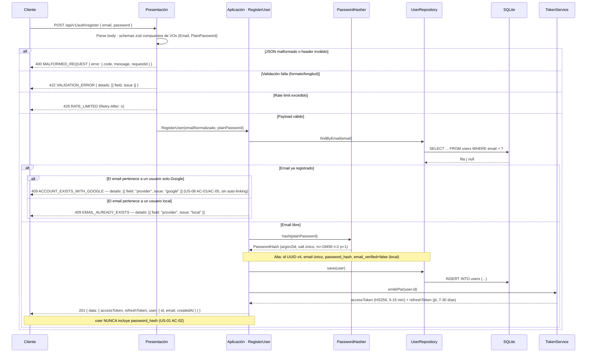
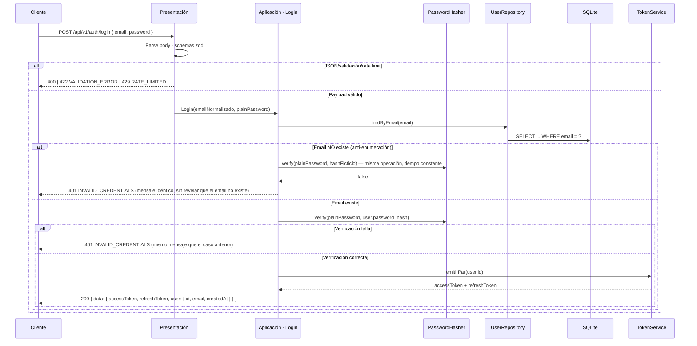
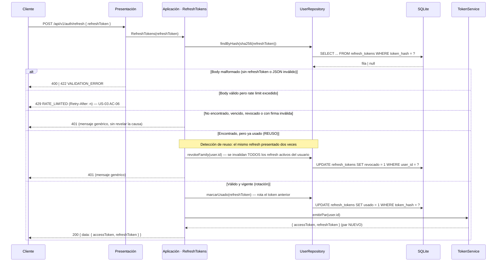
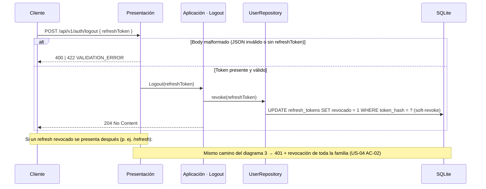
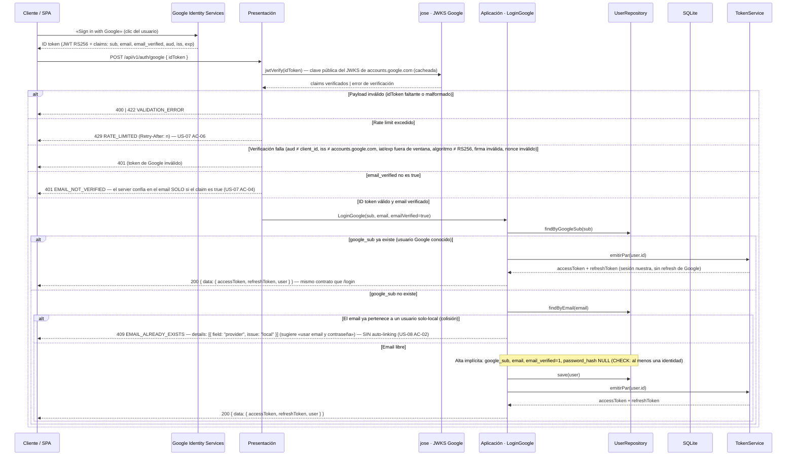
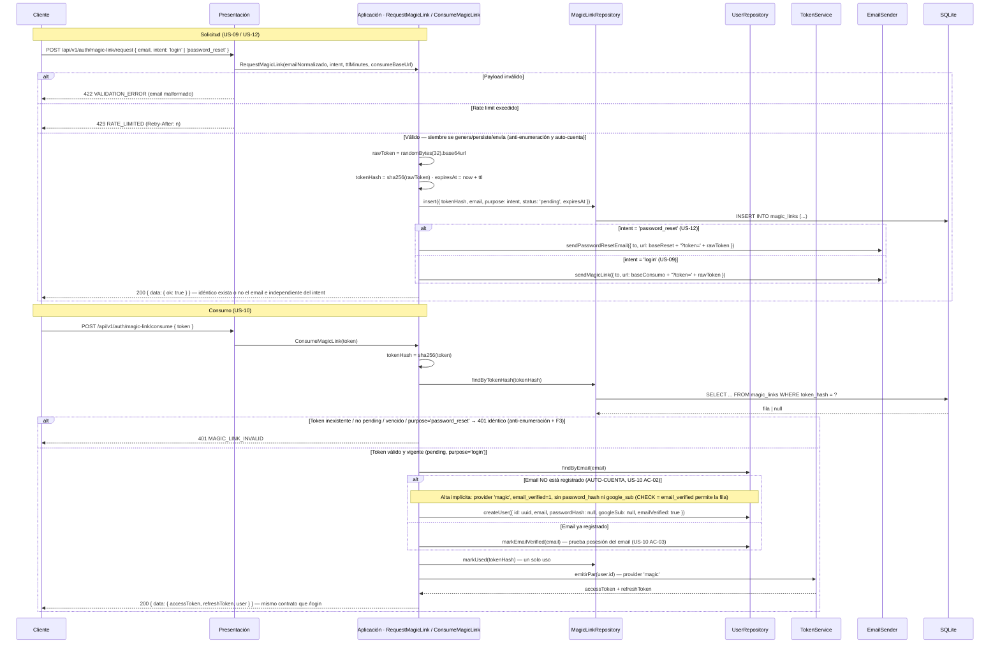
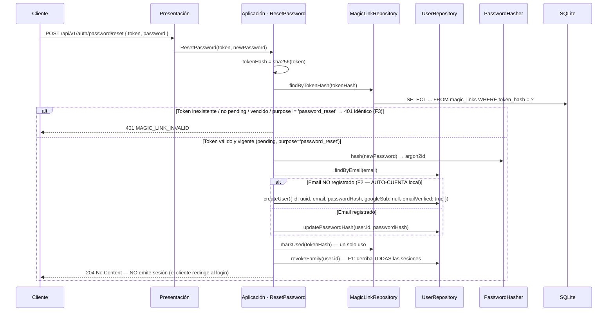
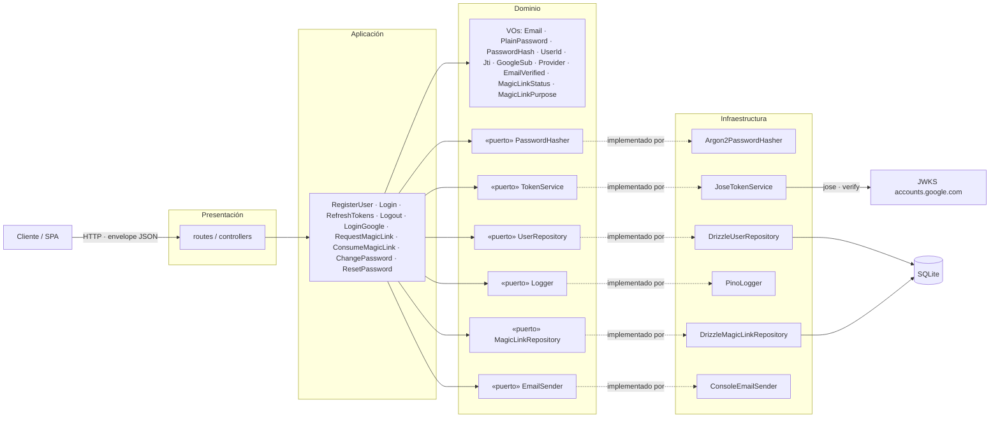

# 02 · Flujos de Registro y Autenticación — Representación Gráfica

**Estado**: Fase 2 de Spec Driven Development — representación gráfica de `01-historias-de-usuario.md`, auditada contra el contrato OpenAPI (`03-openapi.yaml`) y el modelo de datos (`04-modelo-de-datos.md`). **Implementada y verificada en la fase 3 (29-ago-2026 → 5-sep-2026)**: cada flujo de este documento tiene su test e2e en `test/e2e.test.ts`, `test/magicLink.test.ts`, `test/changePassword.test.ts` y `test/passwordReset.test.ts` (US-01..12, 74 tests en verde).
**Fuente**: historias US-01 a US-10 y consideraciones `00-consideraciones-tecnicas.md` (ítems 16-24 errores, 35 hashing, 36-38 tokens, 41-42 hardening/logout, 43-47 Google OIDC, 50-52 magic link).
**Cómo leer**: cada diagrama es un proceso completo con sus caminos de éxito y error; las respuestas de error siguen siempre el envelope `{ error: { code, message, details? } }` con `requestId` (doc 00 → ítems 20-21); las de éxito, `{ data: ... }`.

## 0. Leyenda de participantes

| Alias | Rol |
|---|---|
| `C` | Cliente (SPA/web o móvil/CLI) que consume la API |
| `P` | Presentación — rutas/controllers (capa delgada) |
| `A` | Aplicación — caso de uso (lógica de negocio) |
| `T` | Infraestructura — `TokenService` (emisión/verificación jose) |
| `H` | Infraestructura — `PasswordHasher` (argon2id) |
| `R` | Infraestructura — `UserRepository` (acceso a datos) |
| `M` | Infraestructura — `MagicLinkRepository` (acceso a datos de `magic_links`) |
| `E` | Infraestructura — `EmailSender` (envío de magic links) |
| `DB` | SQLite (better-sqlite3 + Drizzle) |
| `GIS` | Google Identity Services — "Sign in with Google" (lado cliente) |
| `JWKS` | JSON Web Key Set de Google (`accounts.google.com/.well-known/jwks.json`) — claves públicas de firma |

Reglas transversales que aplican a todos los diagramas (doc 00 → ítems 16-24, 41, 48-49):

- `400` = JSON/header malformado · `401` = no autenticado (mensaje genérico) · `409` = conflicto de identidad · `422` = validación zod con `details` por campo · `429` = rate limit · `500` = genérico con `requestId`.
- Rate limiting en `/register`, `/login`, `/refresh`, `/google` y `/auth/magic-link/*` (más agresivo que el global); `429` con `Retry-After`.
- El access token dura 5-15 min (HS256, algoritmo fijado); el refresh 7-30 días, guardado **hasheado** (SHA-256) con su `jti` y rotado en cada uso.
- El magic link es un token **opaco** (≥ 32 bytes aleatorios) persistido solo como **hash** SHA-256, con TTL corto y un solo uso.

---

## 1. Registro local — US-01 (+ colisión US-08)

Notas:

- La unicidad del email está garantizada a nivel de BD (índice único), no solo por la validación previa: dos registros simultáneos → uno `201`, el otro `409` (US-01 AC-06).
- `422` precede a todo: payload inválido nunca llega al hashing ni a la BD (doc 00 → ítem 19).
- Cualquier error inesperado de infraestructura → `500 INTERNAL_ERROR` con `requestId` (doc 00 → ítem 20).

---

## 2. Login local — US-02

Notas:

- Anti-enumeración (doc 00 → ítem 41, US-02 AC-02/AC-03): ambos caminos de fallo devuelven exactamente el mismo `401` y consumen un tiempo equivalente (verificación contra hash ficticio cuando el email no existe, comparación en tiempo constante de argon2id).
- `422` precede la verificación: payload inválido nunca ejecuta hashing ni consulta por email (US-02 AC-06). Rate limit por IP **y por email** (US-02 AC-04).
- El flujo de refresh de este login es el del diagrama 3; el de logout, el del diagrama 4.
- Usuario solo-Google (password_hash NULL) intentando login local → cae en «Verificación falla» → `401 INVALID_CREDENTIALS` genérico: la colisión no se revela en login (US-08 AC-04).

---

## 3. Refresco de tokens — US-03

Notas:

- Cada refresh consume el token: el par nuevo es el único usable a partir de entonces (US-03 AC-02).
- La BD guarda el hash SHA-256 del refresh, nunca el token en claro (doc 00 → ítem 38, US-03 AC-05): un leak de la DB no expone refresh utilizables.
- El reuso es el indicador de robo por excelencia: la respuesta es `401` genérico (el atacante no debe saber que detectamos el reuso) mientras se revoca toda la familia (US-03 AC-03).
- US-03 AC-04 menciona «firma inválida»: nuestro refresh es **opaco** (no-JWT, doc 00 → ítem 38), así que ese caso se interpreta como token ilegible/malformado/truncado — no hay firma que validar (doc 04).

---

## 4. Logout — US-04

Notas:

- El access token vigente no se revoca explícitamente: expira solo por su corta vida (5-15 min); comportamiento documentado y esperado (US-04 AC-04, doc 00 → ítem 42).
- Logout sin token o con token inválido → `401` (token ausente = no autenticado, semántica transversal); body ausente → `400` (US-04 AC-03).
- **Soft-revoke y no `DELETE`**: si el refresh se borrara de la tabla, presentarlo después de un logout sería un token «inexistente» (camino AC-04) y NO podría disparar la revocación de familia que exige US-04 AC-02. Marcar `revocado = 1` conserva la fila y el reuso posterior recorre el diagrama 3 completo. El ítem 42 («borrarlo de DB») queda reconciliado como borrado lógico; mismo comportamiento para `usado` (rotación, diagrama 3) — ver `04-modelo-de-datos.md`.

---

## 5. Login con Google — US-07 (+ colisión US-08)

Notas:

- Verificación estrictamente server-side con jose (`createRemoteJWKSet` con caché): `aud` = client_id configurado, `iss` = accounts.google.com, `iat`/`exp` dentro de ventana tolerada, algoritmo RS256 fijado, nonce validado si GIS lo incluye (doc 00 → ítems 43-44, US-07 AC-03).
- El ID token viaja en el body, NO como header `Authorization`; endpoint JSON sin cookies → sin CSRF clásico; CORS con allowlist (US-07 AC-06).
- Sesiones de usuarios Google usan **nuestros** refresh tokens (misma tabla, rotación y detección de reuso del diagrama 3); nunca se pide el refresh token de Google (doc 00 → ítem 47).
- `user.id` es el mismo `users.id` sin importar el proveedor: los endpoints protegidos no distinguen origen.

---

## 6. Magic link (solicitud + consumo) — US-09/US-10

Notas:

- **Anti-enumeración estricta (US-09 AC-02)**: la respuesta `200 { ok: true }` y el trabajo realizado (token + hash + insert + envío) son idénticos exista o no el email — sin side-channel temporal. El lado negativo (no enviar si no existe) fue **descartado**: es incompatible con la auto-cuenta (US-10 AC-02) porque un usuario nuevo jamás recibiría el link.
- **Hash, no claro (US-09 AC-03)**: la BD guarda solo `sha256(rawToken)`; un leak de `magic_links` no expone enlaces utilizables.
- **Un solo uso (US-10 AC-04)**: `markUsed` se ejecuta sobre el hash; reusar el token → 401 `MAGIC_LINK_INVALID` idéntico a inexistente/vencido (anti-enumeración).
- El email verificado del consume (auto-cuenta o `markEmailVerified`) habilita el CHECK de identidad `users` ampliado (`... OR email_verified = 1`, doc 04 → decisión 5).
- **Intento y propósito (US-12)**: `intent` del request (default `'login'`) se persiste como `purpose`; la URL de consumo la resuelve el handler según el intent (`MAGIC_LINK_CONSUME_BASE_URL` vs `MAGIC_LINK_PASSWORD_RESET_CONSUME_BASE_URL`, doc 00 → nº 56). **F3**: un enlace de `password_reset` presentado en el consume de sesión responde el mismo 401 idéntico.

---

### 6.1 Recuperación de contraseña — US-12

Mismo canal del diagrama 6 con `intent: 'password_reset'`: el enlace se envía contra
`MAGIC_LINK_PASSWORD_RESET_CONSUME_BASE_URL` y se persiste con `purpose = 'password_reset'`.

Notas del reset:

- **Sin sesión**: el reset responde `204`, jamás un par de tokens — el flujo "olvidé" no crea sesión sin pasar por el login.
- **F1** — el reset derriba TODAS las sesiones (misma política que change-password, US-11): las sesiones emitidas bajo el secreto viejo dejan de valer; el cliente re-autentica con el nuevo.
- **F2** — email no registrado → auto-cuenta local (`email_verified = 1`): el enlace prueba la posesión del email (coherente con US-10 AC-02); quien "olvidó" su contraseña sin estar registrado queda registrado con la nueva.
- **F3** — separación de canales: un enlace de login no restablece contraseña, y un enlace de reset no crea sesión — ambos responden el mismo 401 `MAGIC_LINK_INVALID` (anti-enumeración).

---

## 7. Arquitectura por capas y sus puertos

Notas:

- Dependencia estricta hacia adentro: `presentation → application → domain`; el dominio jamás importa Express, SQLite ni pino (doc 00 → ítem 25).
- Los puertos se definen en domain/application y los adapters se inyectan por constructor (DIP): cambiar argon2 por scrypt o SQLite por Postgres implica **añadir un adaptador**, nunca tocar el dominio (doc 00 → ítem 26, OCP).
- Los VOs brandeados con Zod (sección 6.1) son el vocabulario del dominio: el input sucio se parsea una sola vez en la frontera y circula como tipo ya válido (*parse, don't validate*).
- El `EmailSender` es un puerto con una impl de consola (`ConsoleEmailSender`, loguea `to` + `url` en desarrollo); en producción se sustituye por un adapter SMTP/transaccional sin tocar el caso de uso.

---

## Trazabilidad

| Diagrama | Historia | Consideraciones (doc 00) |
|---|---|---|
| 1. Registro local | US-01, US-08 (AC-01) | 16-24, 35, 38, 41, 49 |
| 2. Login local | US-02 | 35, 40, 41 |
| 3. Refresco de tokens | US-03 | 38, 40 |
| 4. Logout | US-04 | 38, 42 |
| 5. Login con Google | US-07, US-08 (AC-02) | 43-47 |
| 6. Magic link (+ reset 6.1) | US-09, US-10, US-12 | 38, 41, 55, 56 |
| 7. Capas y puertos | (transversal) | 25-28, 6.1 |