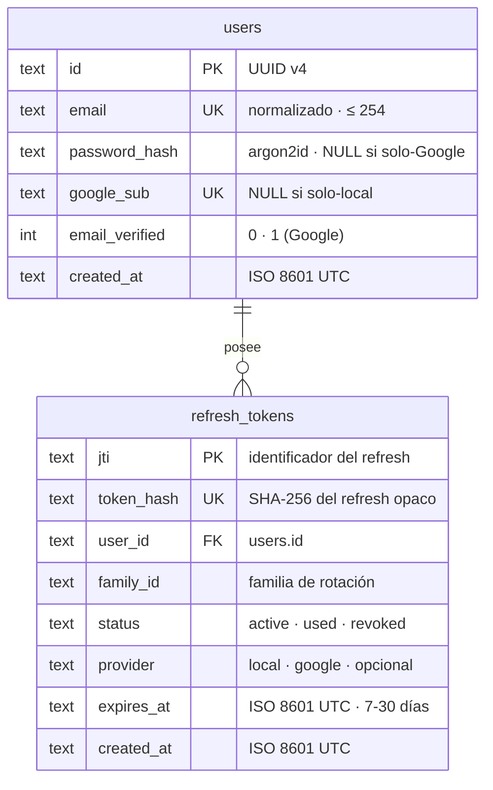

# 04 · Modelo de Datos — API Signup/Login

**Estado**: Fase 2 de Spec Driven Development — modelo de datos **derivado** del contrato OpenAPI (`03-openapi.yaml`), de los flujos auditados (`02-flujos-registro-autenticacion.md`) y de las consideraciones (`00-consideraciones-tecnicas.md`). **Referencia de implementación — fase 3 completada (29-ago-2026)**: esquema Drizzle 1:1 en `src/db/schema.ts` + migración `migrations/0000_rare_blue_marvel.sql`, verificado contra este documento (CHECKs y FKs incluidas).
**Fuente**: doc 00 → ítems 15 (timestamps), 30-33 (SQLite/Drizzle/migraciones), 35 (argon2id), 38 (refresh hasheado + jti), 42 (logout), 44-47 (Google OIDC, `users` nullable); historias US-01, US-03, US-04, US-07, US-08; diagramas 3-4 del doc 02.
**Cómo leer**: cada tabla traza columna a columna su origen en la sección [Trazabilidad](#trazabilidad-columna--fuente). Las decisiones que el modelo toma más allá de la literalidad del plan están explicadas en [Decisiones derivadas](#decisiones-derivadas).

---

## 1. ERD



---

## 2. DDL SQLite (normalizado)

```sql
-- users: identidad única multicanal (local y/o Google)
CREATE TABLE users (
  id             TEXT PRIMARY KEY,                                -- UUID v4 (VOs: UserId)
  email          TEXT NOT NULL UNIQUE,                            -- normalizado, <= 254 (VOs: Email)
  password_hash  TEXT,                                            -- argon2id m=19456 t=2 p=1 (VOs: PasswordHash)
  google_sub     TEXT UNIQUE,                                     -- sub de Google (VOs: GoogleSub)
  email_verified INTEGER NOT NULL DEFAULT 0 CHECK (email_verified IN (0, 1)),
  created_at     TEXT NOT NULL,                                   -- ISO 8601 UTC
  CHECK (password_hash IS NOT NULL OR google_sub IS NOT NULL)     -- al menos una identidad
) STRICT;

-- refresh_tokens: sesiones de refresco (rotación + reuso + logout)
CREATE TABLE refresh_tokens (
  jti        TEXT PRIMARY KEY,                                    -- identificador del refresh (VOs: Jti)
  token_hash TEXT NOT NULL UNIQUE,                                -- SHA-256 del refresh opaco
  user_id    TEXT NOT NULL REFERENCES users(id) ON DELETE CASCADE,
  family_id  TEXT NOT NULL,                                       -- familia de rotación; en este diseño family_id = user_id
  status     TEXT NOT NULL CHECK (status IN ('active', 'used', 'revoked')),
  provider   TEXT CHECK (provider IN ('local', 'google')),        -- origen de la sesión (informacional)
  expires_at TEXT NOT NULL,                                       -- vigencia 7-30 días (ISO 8601 UTC)
  created_at TEXT NOT NULL,                                       -- ISO 8601 UTC
  FOREIGN KEY (family_id) REFERENCES users(id)
) STRICT;

CREATE INDEX idx_refresh_tokens_user_id   ON refresh_tokens(user_id);
CREATE INDEX idx_refresh_tokens_family_id ON refresh_tokens(family_id);
```

Correspondencia con el diagrama 3 del doc 02 (búsqueda y estados):

| Operación (doc 02) | SQL equivalente |
|---|---|
| `findByHash(sha256(refreshToken))` → `SELECT ... WHERE token_hash = ?` | `SELECT * FROM refresh_tokens WHERE token_hash = ?` |
| `marcarUsado(refreshToken)` → `SET usado = 1` | `UPDATE refresh_tokens SET status = 'used' WHERE token_hash = ?` |
| `revokeFamily(user.id)` → `SET revocado = 1 WHERE user_id = ?` | `UPDATE refresh_tokens SET status = 'revoked' WHERE family_id = ?` |
| `revoke(refreshToken)` logout → `SET revocado = 1` (soft-revoke) | `UPDATE refresh_tokens SET status = 'revoked' WHERE token_hash = ?` |

> El modelo elimina la colisión del borrado físico del doc 02 original (`DELETE FROM refresh_tokens`): si el refresh se borrara, presentarlo tras un logout sería un token «inexistente» y no podría disparar la revocación de familia que exige **US-04 AC-02**. `status = 'revoked'` conserva la fila y el reuso posterior sigue el camino del diagrama 3 (ver doc 02 → diagrama 4, nota de reconciliación).

---

## 3. Trazabilidad columna → fuente

### `users`

| Columna | Fuente |
|---|---|
| `id` | doc 00 → nº 45 (`id uuid` PK); US-07 AC-02 (el `users.id` es único sin importar el proveedor) |
| `email` | doc 00 → nº 45 (`email UNIQUE`, normalizado, ≤ 254); US-01 AC-01 |
| `password_hash` | doc 00 → nº 35 (argon2id) y nº 45 (nullable); US-07 AC-02 (alta implícita Google con `password_hash NULL`); US-08 AC-04 (login local de usuario solo-Google → 401 genérico) |
| `google_sub` | doc 00 → nº 45 (`google_sub` nullable); US-07 AC-02; US-08 AC-01/AC-02 (colisión). **UNIQUE deriva** de la necesidad de `findByGoogleSub(sub)` sin ambigüedad (diagrama 5) |
| `email_verified` | US-07 AC-02 (`email_verified = 1`) y AC-04 (server confía en el email solo si `true`); diagrama 1 (registro local → `false`) |
| `created_at` | doc 00 → nº 15 (timestamps ISO 8601 en BD); US-01 AC-02 (`createdAt` en la respuesta) |
| CHECK ≥ 1 identidad | doc 00 → nº 45 (modelo `users` nullable: «pass nullable si Google y google_sub nullable si local»); US-07 AC-02 (alta implícita sin password) |

### `refresh_tokens`

| Columna | Fuente |
|---|---|
| `jti` | doc 00 → nº 38 («guardado … con su jti»); US-03 (rotación por token) |
| `token_hash` | doc 00 → nº 38 («guardado **hasheado** en DB»); US-03 AC-05 (**UNIQUE** derivado: `findByHash` exige búsqueda determinista por hash, diagrama 3) |
| `user_id` | US-03 AC-03 (revocación por usuario/familia); diagrama 3 (`revokeFamily(user.id)`) |
| `family_id` | US-03 AC-03 («revoca **toda la familia**»): en este diseño `family_id = user_id` al emitir (una familia por usuario); columna propia deja la puerta abierta a familias por dispositivo/sesión en iteraciones futuras (doc 01 → nº 161) |
| `status` | US-03 AC-02 (`used` tras rotar), US-04 AC-02 (`revoked` tras logout presenciado), US-03 AC-04 (revocado/vencido → 401). Un único enum evita estados imposibles (dos flags booleanos permitirían `usado=1 y revocado=1`) |
| `provider` | doc 00 → nº 47 («sesiones de usuarios Google usan **nuestros** refresh»); informacional: permite estadísticas y políticas futuras por origen |
| `expires_at` | doc 00 → nº 38 (vigencia 7-30 días); US-03 AC-04 (vencido → 401) |
| `created_at` | doc 00 → nº 15 (timestamps ISO 8601 en BD) |

---

## 4. Decisiones derivadas

| # | Decisión | Racional (fuente) |
|---|---|---|
| 1 | **`status` único** (`active`/`used`/`revoked`) en vez de dos flags `usado`+`revocado` | Los estados son mutuamente excluyentes: un refresh rotado ya no puede revocarse por reuso, un refresh revocado por logout no se vuelve a usar. Un CHECK evita el estado inválido `used AND revoked`, y el reuso se detecta por «fila en `used`/`revoked` presentada de nuevo» (US-04 AC-02, US-03 AC-03) |
| 2 | **`family_id`** (no solo `user_id`) | US-03 AC-03 revoca la **familia** en reuso. Hoy `family_id = user_id` (una familia por usuario) pero la columna permite futuro multi-sesión (doc 01 → nº 161) sin migración de esquema |
| 3 | **Logout = soft-revoke** (`status='revoked'`), nunca `DELETE` | Reconciliación de doc 00 → nº 42 («borrarlo de DB») con US-04 AC-02: borrar físicamente rompería la detección de reuso post-logout. El ítem 42 se interpreta como **borrado lógico** (ver tabla de correspondencia y nota del diagrama 4 en doc 02) |
| 4 | **`google_sub UNIQUE`** | `findByGoogleSub` (diagrama 5) debe resolver un solo usuario; `UNIQUE` hace la colisión Google-Google imposible a nivel BD (análogo a US-01 AC-06 para email) |

---

## 5. Lo que NO es tabla (y por qué)

| Candidato | Decisión | Racional |
|---|---|---|
| `access_tokens` | ❌ No hay tabla | JWT stateless (doc 00 → nº 36-37): la validez la verifica la firma HS256 y `exp`, no la BD; revocación innecesaria con vida de 5-15 min |
| `sessions` | ❌ No hay tabla | La «sesión» persiste como refresh token activo; listar sesiones por dispositivo es iteración futura (doc 01 → nº 161) y ya está soportado estructuralmente por `family_id` |
| `rate_limits` | ❌ No hay tabla | Rate limiting en memoria/aplicación (doc 00 → nº 41, 49), no persistente |
| `google_refresh_tokens` | ❌ No hay tabla | Nunca se pide ni guarda el refresh de Google (doc 00 → nº 47); las sesiones Google usan nuestros `refresh_tokens` |
| Migraciones | 📁 Versionadas (Drizzle, doc 00 → nº 32) | El esquema evoluciona con migraciones SQL versionadas, no con sync automático |

---

## 6. Notas de implementación

- Drizzle define el mismo esquema 1:1 (doc 00 → nº 30-33); `better-sqlite3` con `foreign_keys = ON` y WAL.
- Tipos nativos: `TEXT` para UUID/ISO-8601/JTI y `INTEGER` para `email_verified` (SQLite no distingue más; los VOs del dominio (doc 02 → diagrama 6) validan la semántica en la frontera).
- Los VOs mapean a columnas: `UserId → users.id`, `Email → users.email`, `PasswordHash → users.password_hash`, `GoogleSub → users.google_sub`, `EmailVerified → users.email_verified`, `Jti → refresh_tokens.jti`, `Provider → refresh_tokens.provider`.
- Índices: cobertura de las búsquedas de los diagramas (búsqueda por email, por google_sub, por token_hash — únicos ya indexados; por user_id y family_id en índices separados).