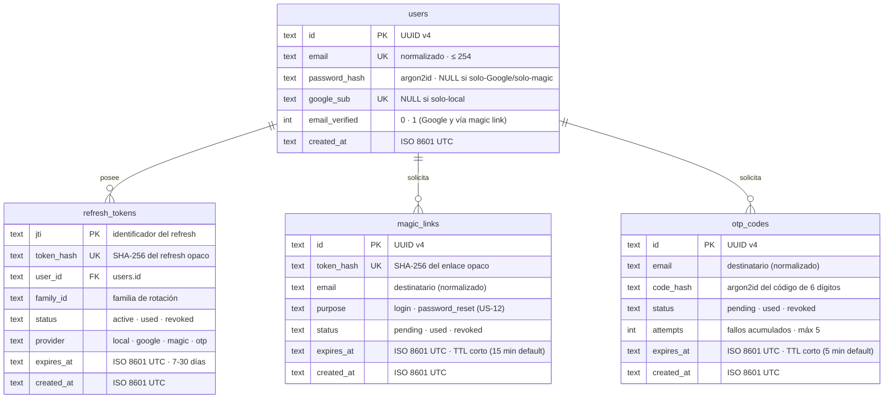

# 04 · Modelo de Datos — API Signup/Login

**Estado**: Fase 2 de Spec Driven Development — modelo de datos **derivado** del contrato OpenAPI (`03-openapi.yaml`), de los flujos auditados (`02-flujos-registro-autenticacion.md`) y de las consideraciones (`00-consideraciones-tecnicas.md`). **Referencia de implementación — fase 3 completada (29-ago-2026)**: esquema Drizzle 1:1 en `src/db/schema.ts` + migración `migrations/0000_rare_blue_marvel.sql`, verificado contra este documento (CHECKs y FKs incluidas). **Ampliado (5-sep-2026)**: `magic_links.purpose` para la recuperación de contraseña (US-12) — migración `0002_busy_avengers.sql`, verificada contra este documento. **Actualizado (11-sep-2026)**: `family_id` pasa a UUID de sesión (una familia por login) y se elimina su FK a `users` — migración `0003_cloudy_lucky_pierre.sql`, verificada contra la decisión 2 de este documento. **Ampliado (19-sep-2026)**: tabla `otp_codes` para el acceso por código OTP (US-13/14) + `provider 'otp'` en la CHECK de `refresh_tokens` — migración `0004_premium_warbound.sql` (+ su UK e índices en el mismo snapshot), verificada contra las decisiones 6, 9-11 de este documento.
**Fuente**: doc 00 → ítems 15 (timestamps), 30-33 (SQLite/Drizzle/migraciones), 35 (argon2id), 38 (refresh hasheado + jti), 42 (logout), 44-47 (Google OIDC, `users` nullable); historias US-01, US-03, US-04, US-07, US-08; diagramas 3-4 del doc 02.
**Cómo leer**: cada tabla traza columna a columna su origen en la sección [Trazabilidad](#trazabilidad-columna--fuente). Las decisiones que el modelo toma más allá de la literalidad del plan están explicadas en [Decisiones derivadas](#decisiones-derivadas).

---

## 1. ERD



---

## 2. DDL SQLite (normalizado)

```sql
-- users: identidad única multicanal (local y/o Google y/o magic) y cuentas guest (US-15/16)
CREATE TABLE users (
  id             TEXT PRIMARY KEY,                                -- UUID v4 (VOs: UserId)
  email          TEXT UNIQUE,                                     -- normalizado, <= 254 (VOs: Email); NULL solo en cuentas guest
  password_hash  TEXT,                                            -- argon2id m=19456 t=2 p=1 (VOs: PasswordHash); NULL si solo-Google/magic/guest
  google_sub     TEXT UNIQUE,                                     -- sub de Google (VOs: GoogleSub)
  email_verified INTEGER NOT NULL DEFAULT 0 CHECK (email_verified IN (0, 1)),
  kind           TEXT NOT NULL DEFAULT 'registered' CHECK (kind IN ('registered','guest')), -- tipo de cuenta: identidad vs anónima (VOs: UserKind)
  created_at     TEXT NOT NULL,                                   -- ISO 8601 UTC
  -- al menos una identidad (local/Google), email ya verificado vía magic link/OTP, o cuenta guest:
  CHECK (password_hash IS NOT NULL OR google_sub IS NOT NULL OR email_verified = 1 OR kind = 'guest')
) STRICT;

-- refresh_tokens: sesiones de refresco (rotación + reuso + logout)
CREATE TABLE refresh_tokens (
  jti        TEXT PRIMARY KEY,                                    -- identificador del refresh (VOs: Jti)
  token_hash TEXT NOT NULL UNIQUE,                                -- SHA-256 del refresh opaco
  user_id    TEXT NOT NULL REFERENCES users(id) ON DELETE CASCADE,
  family_id  TEXT NOT NULL,                                       -- familia de rotación: UUID de sesión por login
  status     TEXT NOT NULL CHECK (status IN ('active', 'used', 'revoked')),
  provider   TEXT CHECK (provider IN ('local', 'google', 'magic', 'otp', 'guest')), -- origen de la sesión (informacional)
  expires_at TEXT NOT NULL,                                       -- vigencia 7-30 días (ISO 8601 UTC)
  created_at TEXT NOT NULL,                                       -- ISO 8601 UTC
) STRICT;

-- magic_links: enlaces de acceso sin contraseña (US-09/US-10) y de recuperación (US-12)
CREATE TABLE magic_links (
  id         TEXT PRIMARY KEY,                                    -- UUID v4 (VOs: MagicLinkId)
  token_hash TEXT NOT NULL UNIQUE,                                -- SHA-256 del enlace opaco
  email      TEXT NOT NULL,                                       -- destinatario normalizado (VOs: Email)
  purpose    TEXT NOT NULL DEFAULT 'login' CHECK (purpose IN ('login', 'password_reset')), -- canal del enlace (VOs: MagicLinkPurpose)
  status     TEXT NOT NULL DEFAULT 'pending' CHECK (status IN ('pending', 'used', 'revoked')),
  expires_at TEXT NOT NULL,                                       -- TTL corto: 15 min default (MAGIC_LINK_TTL_MINUTES)
  created_at TEXT NOT NULL                                        -- ISO 8601 UTC
) STRICT;

CREATE INDEX idx_refresh_tokens_user_id   ON refresh_tokens(user_id);
CREATE INDEX idx_refresh_tokens_family_id ON refresh_tokens(family_id);
CREATE INDEX idx_magic_links_email   ON magic_links(email);
CREATE INDEX idx_magic_links_status  ON magic_links(status);

-- otp_codes: códigos de acceso de 6 dígitos por email (US-13/US-14)
CREATE TABLE otp_codes (
  id         TEXT PRIMARY KEY,                                    -- UUID v4 (VOs: OtpCodeId)
  email      TEXT NOT NULL,                                       -- destinatario normalizado (VOs: Email)
  code_hash  TEXT NOT NULL,                                       -- argon2id del código (nunca claro; doc 00 → ítem 34)
  status     TEXT NOT NULL DEFAULT 'pending' CHECK (status IN ('pending', 'used', 'revoked')), -- (VOs: OtpStatus)
  attempts   INTEGER NOT NULL DEFAULT 0,                          -- fallos acumulados; >= 5 revoca el código
  expires_at TEXT NOT NULL,                                       -- TTL corto: 5 min default (OTP_TTL_MINUTES)
  created_at TEXT NOT NULL                                        -- ISO 8601 UTC
) STRICT;

CREATE INDEX idx_otp_codes_email  ON otp_codes(email);
CREATE INDEX idx_otp_codes_status ON otp_codes(status);
```

Correspondencia con el diagrama 3 del doc 02 (búsqueda y estados):

| Operación (doc 02) | SQL equivalente |
|---|---|
| `findByHash(sha256(refreshToken))` → `SELECT ... WHERE token_hash = ?` | `SELECT * FROM refresh_tokens WHERE token_hash = ?` |
| `marcarUsado(refreshToken)` → `SET usado = 1` | `UPDATE refresh_tokens SET status = 'used' WHERE token_hash = ?` |
| `revokeFamily(familyId)` → `SET revocado = 1 WHERE family_id = ?` | `UPDATE refresh_tokens SET status = 'revoked' WHERE family_id = ?` |
| `revokeAllForUser(userId)` (F1 de US-11/US-12) → `SET revocado = 1 WHERE user_id = ?` | `UPDATE refresh_tokens SET status = 'revoked' WHERE user_id = ?` |
| `revoke(refreshToken)` logout → `SET revocado = 1` (soft-revoke) | `UPDATE refresh_tokens SET status = 'revoked' WHERE token_hash = ?` |

> El modelo elimina la colisión del borrado físico del doc 02 original (`DELETE FROM refresh_tokens`): si el refresh se borrara, presentarlo tras un logout sería un token «inexistente» y no podría disparar la revocación de familia que exige **US-04 AC-02**. `status = 'revoked'` conserva la fila y el reuso posterior sigue el camino del diagrama 3 (ver doc 02 → diagrama 4, nota de reconciliación).

---

## 3. Trazabilidad columna → fuente

### `users`

| Columna | Fuente |
|---|---|
| `id` | doc 00 → nº 45 (`id uuid` PK); US-07 AC-02 (el `users.id` es único sin importar el proveedor) |
| `email` | doc 00 → nº 45 (`email UNIQUE`, normalizado, ≤ 254); US-01 AC-01. **Nullable desde US-15** (el guest no tiene identidad; el unique index sigue válido porque SQLite permite múltiples NULL) |
| `password_hash` | doc 00 → nº 35 (argon2id) y nº 45 (nullable); US-07 AC-02 (alta implícita Google con `password_hash NULL`); US-08 AC-04 (login local de usuario solo-Google → 401 genérico); NULL también en guest (US-15) |
| `google_sub` | doc 00 → nº 45 (`google_sub` nullable); US-07 AC-02; US-08 AC-01/AC-02 (colisión). **UNIQUE deriva** de la necesidad de `findByGoogleSub(sub)` sin ambigüedad (diagrama 5) |
| `email_verified` | US-07 AC-02 (`email_verified = 1`) y AC-04 (server confía en el email solo si `true`); diagrama 1 (registro local → `false`) |
| `kind` | US-15/US-16 (eje identidad: `'registered'` vs `'guest'`); `DEFAULT 'registered'` retrocompatible (migración 0005 copia filas y el default llena la columna); NO es rol ni estado de moderación |
| `created_at` | doc 00 → nº 15 (timestamps ISO 8601 en BD); US-01 AC-02 (`createdAt` en la respuesta) |
| CHECK ≥ 1 identidad | doc 00 → nº 45 (modelo `users` nullable: «pass nullable si Google y google_sub nullable si local»); US-07 AC-02 (alta implícita sin password). **Ampliado en US-15**: `OR kind = 'guest'` — el guest es la única cuenta que puede existir sin identidad |

### users.kind — tipo de cuenta (eje identidad)

`kind` es un discriminador de TIPO DE CUENTA: responde a "¿qué relación tiene esta
cuenta con una identidad real?". **NO es un rol ni un estado.**

| Valor | Significado |
|---|---|
| `'registered'` | Cuenta ligada a una identidad real (email con password, Google, magic link u OTP). |
| `'guest'` | Cuenta anónima temporal, creada sin identidad (`POST /auth/guest`); puede reclamar email+password después (`POST /auth/guest/upgrade` → pasa a `'registered'`). |

- Columna `kind` TEXT NOT NULL DEFAULT 'registered' → retrocompatible: todos los
  usuarios preexistentes quedan `'registered'` sin migración de datos.
- `CHECK kind IN ('registered','guest')` derivado del VO `userKindValues` (fuente
  única, patrón `inList` de schema.ts).
- El CHECK de identidad de `users` se amplía:
  `(password_hash IS NOT NULL OR google_sub IS NOT NULL OR email_verified = 1 OR kind = 'guest')`
  → un guest puede existir sin identidad; cualquier otro tipo no.
- Uso: creación de guest en `POST /auth/guest`, conmutación a `'registered'` en
  `POST /auth/guest/upgrade`, e informativo en el payload `user.kind` (AuthResponse y `/auth/me`).
- **Regla de diseño (no violar)**: `kind` es el eje IDENTIDAD. Roles/autorización
  (columna `role` futura: user/admin/...) y estados de moderación (active/suspended/...)
  son ejes independientes; `kind` NO debe absorberlos (sin kitchen-sink — SRP, doc 05).
  Si un futuro requisito necesita autorización por tipo de cuenta, se consulta `kind`
  (p. ej. guard `requireRegistered`), pero no se añaden valores ajenos al enum.

### `refresh_tokens`

| Columna | Fuente |
|---|---|
| `jti` | doc 00 → nº 38 («guardado … con su jti»); US-03 (rotación por token) |
| `token_hash` | doc 00 → nº 38 («guardado **hasheado** en DB»); US-03 AC-05 (**UNIQUE** derivado: `findByHash` exige búsqueda determinista por hash, diagrama 3) |
| `user_id` | US-03 AC-03 (revocación por usuario — cambio/reset de password, F1 de US-11/US-12); diagrama 3 (`revokeAllForUser(userId)`) |
| `family_id` | US-03 AC-03 («revoca **toda la familia**»): UUID de **sesión** por login (una familia por sesión/dispositivo); la rotación hereda el family_id presentado; el reuso revoca SOLO esa familia (docs/06 §5) |
| `status` | US-03 AC-02 (`used` tras rotar), US-04 AC-02 (`revoked` tras logout presenciado), US-03 AC-04 (revocado/vencido → 401). Un único enum evita estados imposibles (dos flags booleanos permitirían `usado=1 y revocado=1`) |
| `provider` | doc 00 → nº 47 («sesiones de usuarios Google usan **nuestros** refresh»); informacional: permite estadísticas y políticas futuras por origen. `'guest'` añadido en US-15 (sesión de cuenta anónima) |
| `expires_at` | doc 00 → nº 38 (vigencia 7-30 días); US-03 AC-04 (vencido → 401) |
| `created_at` | doc 00 → nº 15 (timestamps ISO 8601 en BD) |

### `magic_links`

| Columna | Fuente |
|---|---|
| `id` | convención `id UUID v4` (doc 00 → nº 45) aplicada a los enlaces |
| `token_hash` | US-09 AC-03 (persistir solo el **hash** SHA-256 del enlace opaco). **UNIQUE** derivado: `findByTokenHash(sha256(token))` debe resolver un único enlace (diagrama magic link) |
| `email` | US-09 AC-01 (destinatario; el enlace se emite para un email conocido por el servidor tras generar el token) |
| `purpose` | US-12 (canal de recuperación) sobre el canal US-09/10: `intent` del request → `purpose` persistido (doc 00 → nº 56); `DEFAULT 'login'` conserva el comportamiento US-09/10 y hace retrocompatible la migración 0002. **F3**: el consumo de sesión solo acepta `login` y el reset solo `password_reset` |
| `status` | US-10 AC-04 (`used` tras un consumo → un solo uso); `revoked` reservado para revocación manual futura; `pending` inicial. Un único enum evita estados imposibles (mismo racional que `refresh_tokens.status`, decisión 3) |
| `expires_at` | US-09 AC-04 (TTL corto, default 15 min; vencido → `MAGIC_LINK_INVALID`, US-10 AC-05) |
| `created_at` | doc 00 → nº 15 (timestamps ISO 8601 en BD) |

### `otp_codes`

| Columna | Fuente |
|---|---|
| `id` | convención `id UUID v4` (doc 00 → nº 45) aplicada a los códigos |
| `email` | US-13 AC-01 (destinatario; el código se emite para un email, exista o no cuenta — anti-enumeración + auto-cuenta US-14 AC-04) |
| `code_hash` | doc 00 → nº 35 (argon2id) aplicado al código de 6 dígitos: **nunca claro** y, a diferencia del magic link (token opaco 32B servible con SHA-256), el hash lento protege un espacio de búsqueda de solo 10^6 (US-13 AC-02) |
| `status` | US-14 AC-02 (`used` tras una verificación → un solo uso); `revoked` tras agotar intentos (US-14 AC-03) o por rotación (US-13 AC-03); `pending` inicial. Un único enum evita estados imposibles (mismo racional que decisión 7) |
| `attempts` | US-14 AC-03 (máx **5** intentos: `attempts >= 5` revoca el código y fuerza un nuevo request); se incrementa solo en fallos de código |
| `expires_at` | US-13 AC-02 (TTL corto, default 5 min, máx 15; vencido → `OTP_INVALID`, US-14 AC-02) |
| `created_at` | doc 00 → nº 15 (timestamps ISO 8601 en BD) |

---

## 4. Decisiones derivadas

| # | Decisión | Racional (fuente) |
|---|---|---|
| 1 | **`status` único** (`active`/`used`/`revoked`) en vez de dos flags `usado`+`revocado` | Los estados son mutuamente excluyentes: un refresh rotado ya no puede revocarse por reuso, un refresh revocado por logout no se vuelve a usar. Un CHECK evita el estado inválido `used AND revoked`, y el reuso se detecta por «fila en `used`/`revoked` presentada de nuevo» (US-04 AC-02, US-03 AC-03) |
| 2 | **`family_id`** (no solo `user_id`) | US-03 AC-03 revoca la **familia** en reuso. `family_id` = **UUID de sesión** (uno por login); la rotación hereda el presentado. El reuso revoca SOLO esa familia → logouts independientes web/móvil (docs/06 §5). Cambio/reset de password revoca todas las familias del usuario vía `revokeAllForUser` |
| 3 | **Logout = soft-revoke** (`status='revoked'`), nunca `DELETE` | Reconciliación de doc 00 → nº 42 («borrarlo de DB») con US-04 AC-02: borrar físicamente rompería la detección de reuso post-logout. El ítem 42 se interpreta como **borrado lógico** (ver tabla de correspondencia y nota del diagrama 4 en doc 02) |
| 4 | **`google_sub UNIQUE`** | `findByGoogleSub` (diagrama 5) debe resolver un solo usuario; `UNIQUE` hace la colisión Google-Google imposible a nivel BD (análogo a US-01 AC-06 para email) |
| 5 | **CHECK de identidad `users` ampliado** a `... OR email_verified = 1` | Un usuario solo-magic (creado por auto-cuenta en US-10 AC-02) no tiene `password_hash` ni `google_sub`; su email ya está verificado por posesión. Sin la ampliación, la CHECK original `(password_hash IS NOT NULL OR google_sub IS NOT NULL)` impediría persistir el alta implícita |
| 6 | **`provider` en refresh_tokens y CHECK ampliado** | Las sesiones emitidas al consumir un magic link (US-10 AC-01), verificar un OTP (US-14 AC-01) o crear un guest (US-15) usan nuestros refresh (doc 00 → nº 47); `provider` informa su origen. La CHECK pasa de `('local','google')` a `('local','google','magic')` (US-10), `('local','google','magic','otp')` (US-14) y `('local','google','magic','otp','guest')` (US-15) |
| 7 | **`magic_links.status` único** (`pending`/`used`/`revoked`) sin flags | Mismo racional que la decisión 1 aplicado a los enlaces: un solo consumo (`used`) marca el fin de la vida útil; `revoked` queda reservado para revocación proactiva futura |
| 8 | **`magic_links.purpose`** (`login`/`password_reset`, default `'login'`) | Separa los canales `login` (US-09/10) y `password_reset` (US-12) sobre la misma tabla: un enum (no un flag) impide estados imposibles y `DEFAULT 'login'` hace retrocompatible la migración 0002 (las filas copiadas heredan el canal de sesión). Refuerza **F3**: un enlace de un canal no funciona en el otro (consume solo `login`, reset solo `password_reset`) |
| 9 | **`otp_codes.status` único** (`pending`/`used`/`revoked`) sin flags | Mismo racional que la decisión 7 aplicado a los códigos: `used` tras una verificación (un solo uso, US-14 AC-02), `revoked` tras 5 fallos (US-14 AC-03) o por rotación con un request nuevo (US-13 AC-03) |
| 10 | **`otp_codes.attempts`** (`INTEGER NOT NULL DEFAULT 0`) como contador de fallos | El límite de 5 intentos (US-14 AC-03) necesita persistencia para sobrevivir reinicios del server (a diferencia del rate limit de red, doc 00 → nº 41); la revocación al llegar al límite fuerza un nuevo request (rotación) |
| 11 | **`otp_codes` SIN FK a `users`** | El código existe para un email, registrado o no (anti-enumeración US-13 AC-01 + auto-cuenta US-14 AC-04): una FK exigiría el usuario y rompería el flujo de alta implícita. El email es el ancla, como en `magic_links` |
| 12 | **`users.email` nullable + `users.kind` (US-15/16)** | El guest (US-15) es una cuenta **sin identidad**: `email` NULL vía table-rebuild (0005), `kind` como discriminador de tipo de cuenta (`'registered'`/`'guest'`, DEFAULT `'registered'` retrocompatible — las filas preexistentes quedan registradas sin migración de datos). CHECK identidad ampliado con `OR kind = 'guest'`. **`kind` NO es rol ni estado** (regla de diseño: ejes independientes, ver bloque `users.kind` arriba). El upgrade (US-16) reclama email+password → `kind = 'registered'`, sin revocar sesiones |

---

## 5. Lo que NO es tabla (y por qué)

| Candidato | Decisión | Racional |
|---|---|---|
| `access_tokens` | ❌ No hay tabla | JWT stateless (doc 00 → nº 36-37): la validez la verifica la firma HS256 y `exp`, no la BD; revocación innecesaria con vida de 5-15 min |
| `sessions` | ❌ No hay tabla | La «sesión» persiste como refresh token activo agrupado por `family_id` (una familia = una sesión); listar sesiones por dispositivo es iteración futura (doc 01 → nº 161) |
| `rate_limits` | ❌ No hay tabla | Rate limiting en memoria/aplicación (doc 00 → nº 41, 49), no persistente |
| `google_refresh_tokens` | ❌ No hay tabla | Nunca se pide ni guarda el refresh de Google (doc 00 → nº 47); las sesiones Google usan nuestros `refresh_tokens` |
| `email_verification_tokens` | ❌ No hay tabla (separada) | La verificación de email se resuelve con `magic_links` (US-09/10) y `otp_codes` (US-13/14): el mismo enlace/código que autentica prueba la posesión del email (`email_verified = 1`). No hace falta una tabla independiente de confirmación de email |
| Migraciones | 📁 Versionadas (Drizzle, doc 00 → nº 32) | El esquema evoluciona con migraciones SQL versionadas, no con sync automático |

---

## 6. Notas de implementación

- Drizzle define el mismo esquema 1:1 (doc 00 → nº 30-33); `better-sqlite3` con `foreign_keys = ON` y WAL.
- Tipos nativos: `TEXT` para UUID/ISO-8601/JTI y `INTEGER` para `email_verified` (SQLite no distingue más; los VOs del dominio (doc 02 → diagrama 6) validan la semántica en la frontera).
- Los VOs mapean a columnas: `UserId → users.id`, `Email → users.email` (nullable en guest), `PasswordHash → users.password_hash`, `GoogleSub → users.google_sub`, `EmailVerified → users.email_verified`, `UserKind → users.kind`, `Jti → refresh_tokens.jti`, `Provider → refresh_tokens.provider`, `MagicLinkStatus → magic_links.status`, `MagicLinkPurpose → magic_links.purpose`, `OtpCode → otp_codes.code_hash` (solo hash; el código claro nunca se persiste), `OtpStatus → otp_codes.status`.
- Índices: cobertura de las búsquedas de los diagramas (búsqueda por email, por google_sub, por refresh token_hash y por magic token_hash — únicos ya indexados; por user_id, family_id, magic email y magic status en índices separados; por otp email y otp status en índices separados).