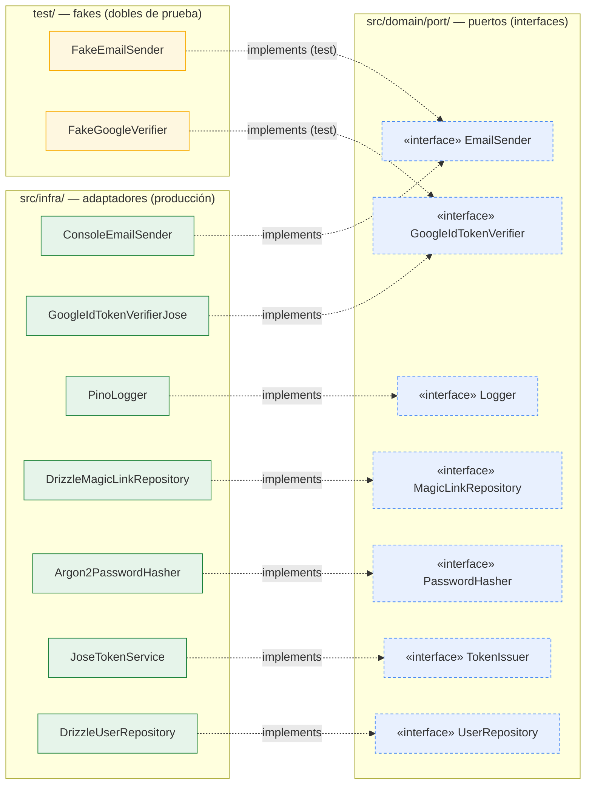

# 09 · Arquitectura Hexagonal — Puertos y Adaptadores

**Stack**: Node.js · Express 5 · TypeScript · Clean Architecture
**Estado**: Generado desde el índice codegraph (`.codegraph/codegraph.db`, nodos `interface`/`class` + aristas `implements`). Muestra qué adaptador de `src/infra/` (y qué fake de `test/`) implementa cada puerto definido en `src/domain/port/`. Complementa `00-consideraciones-tecnicas.md` (decisión de puertos y adaptadores) y `04-modelo-de-datos.md`.

> Versión estática: [`09-arquitectura-hexagonal.svg`](09-arquitectura-hexagonal.svg) · fuente: [`09-arquitectura-hexagonal.mmd`](09-arquitectura-hexagonal.mmd)

## Lectura

| Puerto (interfaz) | Adaptador producción | Fake en test | Tecnología |
|---|---|---|---|
| `EmailSender` | `ConsoleEmailSender` | `FakeEmailSender` | email out (consola en dev) |
| `GoogleIdTokenVerifier` | `GoogleIdTokenVerifierJose` | `FakeGoogleVerifier` | verificación id_token Google (jose) |
| `Logger` | `PinoLogger` | — | pino |
| `MagicLinkRepository` | `DrizzleMagicLinkRepository` | — | Drizzle ORM → SQLite |
| `PasswordHasher` | `Argon2PasswordHasher` | — | argon2id |
| `TokenIssuer` | `JoseTokenService` | — | JWT HS256 (jose) |
| `UserRepository` | `DrizzleUserRepository` | — | Drizzle ORM → SQLite |

Regla hexagonal: **`src/app/` y `src/domain/` dependen solo de las interfaces**; los adaptadores de `infra/` se inyectan en `app/buildUseCases.ts` (ver doc 10 para el circuito completo). Los fakes permiten que `test/` ejercite los use cases sin infraestructura real.

## Fuente / Datos

Snapshot del working tree actual (último commit `0ec8de8` + refactor sin commitear):
- **Origen**: índice `.codegraph/codegraph.db` — 677 nodos · 1717 aristas · 70 archivos
- **Extracción**: aristas `implements` (9) entre nodos `interface`/`class`
- **Render**: Mermaid CLI (`mmdc` 11.6.0) con Chrome del sistema → `.svg`
- **Convención**: este `.md` es la fuente canónica; [`09-arquitectura-hexagonal.mmd`](09-arquitectura-hexagonal.mmd) y `.svg` se regeneran desde su bloque `mermaid`