# 10 · Circuito Handlers → Use Cases → Servicios

**Stack**: Node.js · Express 5 · TypeScript · Clean Architecture
**Estado**: Generado desde el índice codegraph (`.codegraph/codegraph.db`, aristas `calls` entre nodos `route`/`function`/`method`/`class`). Grafo de llamadas por endpoint: **ruta HTTP → handler → use case → servicios infra**. Complementa `08-circuito-rutas-http.md` (cadena de middlewares y orden real) y `03-openapi.yaml` (formas de request/response). Verificado contra el código fuente de `src/api/routes.ts` y `src/api/handlers/`.

```mermaid
flowchart TD
    subgraph HTTP["Capa HTTP — src/index.ts + src/api/routes.ts (montado en /api/v1)"]
        direction TB
        R_REG["POST /auth/register"]
        R_LOGIN["POST /auth/login"]
        R_REF["POST /auth/refresh"]
        R_LOGOUT["POST /auth/logout"]
        R_GOOG["POST /auth/google"]
        R_MLR["POST /auth/magic-link/request"]
        R_MLC["POST /auth/magic-link/consume"]
        R_ME["GET /auth/me"]
    end

    subgraph HAND["Handlers — src/api/handlers/ (buildHandlers)"]
        direction TB
        H_REG["authRegisterHandler"]
        H_LOGIN["authLoginHandler"]
        H_REF["authRefreshHandler"]
        H_LOGOUT["authLogoutHandler"]
        H_GOOG["authGoogleHandler"]
        H_MLR["magicLinkRequestHandler"]
        H_MLC["magicLinkConsumeHandler"]
        H_ME["meHandler"]
    end

    subgraph UC["Use cases — src/app/useCases/"]
        direction TB
        UC_REG["RegisterUser"]
        UC_LOGIN["Login"]
        UC_REF["RefreshTokens"]
        UC_LOGOUT["Logout"]
        UC_GOOG["LoginGoogle"]
        UC_MLR["RequestMagicLink"]
        UC_MLC["ConsumeMagicLink"]
        UC_ME["GetMe"]
    end

    subgraph SVC["Servicios y helpers — src/infra/, app/helpers y domain"]
        direction TB
        SV_USER["DrizzleUserRepository"]
        SV_MAGIC["DrizzleMagicLinkRepository"]
        SV_TOKEN["JoseTokenService"]
        SV_PASS["Argon2PasswordHasher"]
        SV_EMAIL["ConsoleEmailSender"]
        SV_LOG["PinoLogger"]
        SV_SESS["app/helpers/issueSession"]
        SV_EXP["domain/refreshExpiry"]
    end

    R_REG -->|authLimiter| H_REG
    R_LOGIN -->|authLimiter| H_LOGIN
    R_REF -->|authLimiter| H_REF
    R_LOGOUT -->|authLimiter| H_LOGOUT
    R_GOOG -->|authLimiter| H_GOOG
    R_MLR -->|authLimiter| H_MLR
    R_MLC -->|authLimiter| H_MLC
    R_ME -->|requireAuth| H_ME

    H_REG --> UC_REG
    H_LOGIN --> UC_LOGIN
    H_REF --> UC_REF
    H_LOGOUT --> UC_LOGOUT
    H_GOOG --> UC_GOOG
    H_MLR --> UC_MLR
    H_MLC --> UC_MLC
    H_ME --> UC_ME

    UC_REG -->|findByEmail, createUser| SV_USER
    UC_REG -->|hash| SV_PASS
    UC_REG -->|issueSession| SV_SESS
    UC_REG -->|info| SV_LOG

    UC_LOGIN -->|findByEmail| SV_USER
    UC_LOGIN -->|verify| SV_PASS
    UC_LOGIN -->|issueSession| SV_SESS
    UC_LOGIN -->|info, warn| SV_LOG

    UC_REF -->|findByRefreshTokenHash, revokeFamily, markRefreshTokenUsed| SV_USER
    UC_REF -->|isRefreshExpired| SV_EXP
    UC_REF -->|hashRefreshToken| SV_TOKEN
    UC_REF -->|issueSession| SV_SESS
    UC_REF -->|info, warn| SV_LOG

    UC_LOGOUT -->|findByRefreshTokenHash, revokeRefreshToken| SV_USER
    UC_LOGOUT -->|isRefreshExpired| SV_EXP
    UC_LOGOUT -->|hashRefreshToken| SV_TOKEN
    UC_LOGOUT -->|info| SV_LOG

    UC_GOOG -->|findByGoogleSub, createUser| SV_USER
    UC_GOOG -->|verify| SV_PASS
    UC_GOOG -->|issueSession| SV_SESS
    UC_GOOG -->|info| SV_LOG

    UC_MLR -->|insert| SV_MAGIC
    UC_MLR -->|hashRefreshToken| SV_TOKEN
    UC_MLR -->|sendMagicLink| SV_EMAIL
    UC_MLR -->|info| SV_LOG

    UC_MLC -->|findByTokenHash, markUsed| SV_MAGIC
    UC_MLC -->|markEmailVerified| SV_USER
    UC_MLC -->|issueSession| SV_SESS
    UC_MLC -->|info, warn| SV_LOG

    UC_ME -->|findById| SV_USER
    UC_ME -->|info| SV_LOG

    SV_SESS -->|refreshExpiresAt| SV_EXP
    SV_SESS -->|insertRefreshToken| SV_USER
    SV_SESS -->|issueRefreshToken, issueAccessToken, hashRefreshToken| SV_TOKEN

    classDef http fill:#f3e8fd,stroke:#7623bb
    classDef hand fill:#e8f0fe,stroke:#4285f4
    classDef uc fill:#e6f4ea,stroke:#188038
    classDef svc fill:#fef7e0,stroke:#f9ab00
    class R_REG,R_LOGIN,R_REF,R_LOGOUT,R_GOOG,R_MLR,R_MLC,R_ME http
    class H_REG,H_LOGIN,H_REF,H_LOGOUT,H_GOOG,H_MLR,H_MLC,H_ME hand
    class UC_REG,UC_LOGIN,UC_REF,UC_LOGOUT,UC_GOOG,UC_MLR,UC_MLC,UC_ME uc
    class SV_USER,SV_MAGIC,SV_TOKEN,SV_PASS,SV_EMAIL,SV_LOG,SV_SESS,SV_EXP svc
```

> Versión estática: [`10-circuito-handlers-use-cases.svg`](10-circuito-handlers-use-cases.svg) · fuente: [`10-circuito-handlers-use-cases.mmd`](10-circuito-handlers-use-cases.mmd)

## Lectura

- **Guardas**: todos los endpoints `/auth/*` usan `authLimiter` (rate limit estricto, doc 00 → ítems 41, 48-49); solo `GET /auth/me` usa `requireAuth` (valida el access token antes del handler).
- **Inversión de dependencias**: los use cases llaman **métodos de las interfaces** (`UserRepository`, `TokenIssuer`, `PasswordHasher`, `EmailSender`, `Logger`, `MagicLinkRepository`) — los adaptadores concretos (`Drizzle*`, `Jose*`, `Argon2*`, `Pino*`, `Console*`) se inyectan desde `app/buildUseCases.ts` (ver doc 09 para el mapeo puerto → adaptador).
- **`issueSession`** es el helper compartido (`app/helpers/issueSession.ts`) que emite el par access+refresh: participa en register, login, refresh, google y consume magic link.
- **`LoginGoogle`** depende de `GoogleIdTokenVerifier` (no visible aquí por ser dependencia externa); cuando el proveedor no está configurado, el endpoint responde con error 500 de configuración.

## Fuente / Datos

Snapshot del working tree actual (último commit `0ec8de8` + refactor sin commitear):
- **Origen**: índice `.codegraph/codegraph.db` — aristas `calls` entre nodos `route`/`function`/`method`/`class`
- **Verificación**: los use cases se invocan por dispatch dinámico (wireado en `app/buildUseCases.ts`); el circuito por endpoint se confirmó leyendo `src/api/routes.ts` y `src/api/handlers/`
- **Render**: Mermaid CLI (`mmdc` 11.6.0) con Chrome del sistema → `.svg`
- **Convención**: este `.md` es la fuente canónica; [`10-circuito-handlers-use-cases.mmd`](10-circuito-handlers-use-cases.mmd) y `.svg` se regeneran desde su bloque `mermaid`