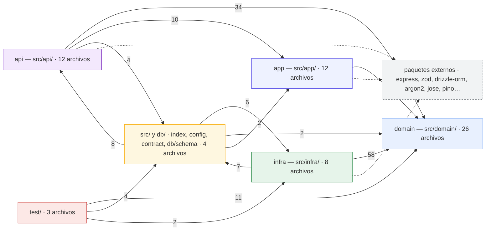

# 11 · Dependencias por Capas — Clusters de Dirección

**Stack**: Node.js · Express 5 · TypeScript · Clean Architecture
**Estado**: Generado desde el índice codegraph (`.codegraph/codegraph.db`, aristas `imports` file→file resueltas con regla ESM `.js`→`.ts`). Dos vistas: **Figura 1** — grafo agregado por capa (conteos de imports inter-capa); **Figura 2** — detalle archivo→archivo con clusters por directorio (solo pares con ≥2 imports). Incluye verificación de la regla de dependencia de la arquitectura hexagonal.

## Figura 1 — Grafo agregado por capas

> Versión estática: [`11-figura1-capas.svg`](11-figura1-capas.svg) · fuente: [`11-figura1-capas.mmd`](11-figura1-capas.mmd)

## Figura 2 — Detalle archivo→archivo (clusters por directorio)

```mermaid
flowchart LR
    subgraph API["api — src/api/ (handlers, middlewares, rutas) · 12 archivos"]
        direction TB
        n0["buildHandlers.ts"]:::api
        n2["deps.ts"]:::api
        n6["authHandlers.ts"]:::api
        n9["magicLinkHandlers.ts"]:::api
        n10["meHandler.ts"]:::api
        n11["authMiddleware.ts"]:::api
        n14["errorMiddleware.ts"]:::api
        n15["envelope.ts"]:::api
        n16["routes.ts"]:::api
        n41["middleware.ts"]:::api
    end
    subgraph APP["app — src/app/ (use cases, helpers) · 12 archivos"]
        direction TB
        n1["buildUseCases.ts"]:::app
        n23["issueSession.ts"]:::app
        n26["consumeMagicLink.ts"]:::app
        n29["getMe.ts"]:::app
        n30["login.ts"]:::app
        n32["loginGoogle.ts"]:::app
        n34["logout.ts"]:::app
        n35["refreshTokens.ts"]:::app
        n36["registerUser.ts"]:::app
        n37["requestMagicLink.ts"]:::app
    end
    subgraph DOMAIN["domain — src/domain/ (VOs, puertos, errores) · 26 archivos"]
        direction TB
        n4["port/index.ts"]:::domain
        n5["tokenIssuer.ts"]:::domain
        n7["apiError.ts"]:::domain
        n8["errorCatalog.ts"]:::domain
        n12["vo/index.ts"]:::domain
        n13["userId.ts"]:::domain
        n17["emailSender.ts"]:::domain
        n18["googleIdTokenVerifier.ts"]:::domain
        n19["logger.ts"]:::domain
        n20["magicLinkRepository.ts"]:::domain
        n21["passwordHasher.ts"]:::domain
        n22["userRepository.ts"]:::domain
        n24["provider.ts"]:::domain
        n25["refreshExpiry.ts"]:::domain
        n27["logEvents.ts"]:::domain
        n28["email.ts"]:::domain
        n31["plainPassword.ts"]:::domain
        n33["uniqueConstraintViolation.ts"]:::domain
        n43["passwordHash.ts"]:::domain
        n47["magicLinkStatus.ts"]:::domain
        n48["timestamp.ts"]:::domain
        n50["googleSub.ts"]:::domain
        n51["jti.ts"]:::domain
        n52["refreshTokenStatus.ts"]:::domain
    end
    subgraph INFRA["infra — src/infra/ (adaptadores) · 8 archivos"]
        direction TB
        n39["compose.ts"]:::infra
        n40["pinoLogger.ts"]:::infra
        n42["argon2PasswordHasher.ts"]:::infra
        n44["consoleEmailSender.ts"]:::infra
        n45["drizzleMagicLinkRepository.ts"]:::infra
        n49["drizzleUserRepository.ts"]:::infra
        n53["googleJwtVerifier.ts"]:::infra
        n54["joseTokenService.ts"]:::infra
    end
    subgraph SRC-OTRO["src/ y db/ — index, config, contract, db/schema · 4 archivos"]
        direction TB
        n3["config.ts"]:::src-otro
        n38["src/index.ts"]:::src-otro
        n46["db/schema.ts"]:::src-otro
    end
    subgraph TEST["test/ (e2e, unit) · 3 archivos"]
        direction TB
        n55["e2e.test.ts"]:::test
        n56["googleJwtVerifier.test.ts"]:::test
        n57["magicLink.test.ts"]:::test
    end

    n14 -->|6 ×| n8
    n14 -->|3 ×| n7
    n15 -->|3 ×| n8
    n16 -->|3 ×| n8
    n38 -->|3 ×| n39
    n38 -->|3 ×| n40
    n38 -->|3 ×| n41
    n38 -->|3 ×| n14
    n49 -->|3 ×| n22
    n0 -->|2 ×| n1
    n2 -->|2 ×| n3
    n6 -->|2 ×| n7
    n6 -->|2 ×| n8
    n6 -->|2 ×| n1
    n9 -->|2 ×| n1
    n10 -->|2 ×| n7
    n10 -->|2 ×| n8
    n10 -->|2 ×| n1
    n11 -->|2 ×| n7
    n11 -->|2 ×| n8
    n11 -->|2 ×| n13
    n16 -->|2 ×| n1
    n16 -->|2 ×| n3
    n23 -->|2 ×| n25
    n26 -->|2 ×| n7
    n26 -->|2 ×| n8
    n26 -->|2 ×| n4
    n26 -->|2 ×| n13
    n29 -->|2 ×| n7
    n29 -->|2 ×| n8
    n29 -->|2 ×| n4
    n30 -->|2 ×| n7
    n30 -->|2 ×| n8
    n30 -->|2 ×| n4
    n30 -->|2 ×| n28
    n30 -->|2 ×| n27
    n32 -->|2 ×| n7
    n32 -->|2 ×| n8
    n32 -->|2 ×| n33
    n32 -->|2 ×| n4
    n32 -->|2 ×| n13
    n32 -->|2 ×| n24
    n34 -->|2 ×| n7
    n34 -->|2 ×| n8
    n34 -->|2 ×| n4
    n34 -->|2 ×| n25
    n35 -->|2 ×| n7
    n35 -->|2 ×| n8
    n35 -->|2 ×| n4
    n35 -->|2 ×| n25
    n36 -->|2 ×| n7
    n36 -->|2 ×| n8
    n36 -->|2 ×| n33
    n36 -->|2 ×| n4
    n36 -->|2 ×| n22
    n36 -->|2 ×| n28
    n36 -->|2 ×| n13
    n37 -->|2 ×| n4
    n38 -->|2 ×| n1
    n38 -->|2 ×| n16
    n39 -->|2 ×| n3
    n39 -->|2 ×| n4
    n44 -->|2 ×| n4
    n45 -->|2 ×| n20
    n49 -->|2 ×| n46
    n49 -->|2 ×| n33
    n53 -->|2 ×| n18
    n54 -->|2 ×| n5
    n54 -->|2 ×| n51
    n40 -->|2 ×| n3
    n55 -->|2 ×| n38
    n55 -->|2 ×| n18
    n56 -->|2 ×| n53
    n57 -->|2 ×| n38

    classDef api fill:#f3e8fd,stroke:#7623bb
    classDef app fill:#eef2ff,stroke:#4f46e5
    classDef domain fill:#e8f0fe,stroke:#4285f4
    classDef infra fill:#e6f4ea,stroke:#188038
    classDef src-otro fill:#fef7e0,stroke:#f9ab00
    classDef test fill:#fce8e6,stroke:#c5221f
```

> Versión estática: [`11-figura2-detalle.svg`](11-figura2-detalle.svg) (1656×4681 — recomendado abrir en pestaña aparte) · fuente: [`11-figura2-detalle.mmd`](11-figura2-detalle.mmd). Los nodos mostrados son solo los archivos con imports inter-capa; los archivos 100% intra-capa no aparecen pero cuentan en el título del cluster. Además solo se grafican los pares con **≥2 imports** (filtro de ruido); los pares con 1 import se contabilizan en la Figura 1.

## Verificación de la regla de dependencia

Regla hexagonal esperada (la misma de `docs/00` y `docs/09`):

| Regla | Observado | ✅ |
|---|---|---|
| `domain` no importa a nadie (solo a sí mismo) | **0 imports salientes** inter-capa | ✅ |
| `app` solo importa `domain` (y configuración raíz) | `app→domain 135`; sin `app→api` ni `app→infra` | ✅ |
| `infra` solo importa `domain` (puertos) y configuración | `infra→domain 58`, `infra→src 7` | ✅ |
| `api` solo importa hacia adentro | `api→domain 34`, `api→app 10`, `api→src 4` (config) | ✅ |
| Composition root (`src/index.ts`) orquesta todo | `src/index.ts→api 8`, `→infra 6` (compose), `→app` | ✅ |
| `test` usa fakes + puertos + composition root | `test→domain 11`, `test→infra 2`, `test→src 4` | ✅ |

**Resultado: 0 violaciones.** Todas las flechas fluyen hacia adentro (`api → app → domain` y `infra → domain`). Los únicos destinos fuera de `domain` son `config.ts` y `db/schema.ts` (raíz de `src/` y `src/db/`), que actúan como configuración transversal, y `src/index.ts` como composition root — ambos permitidos por diseño.

**Nota de cálculo**: los conteos son imports inter-capa individuales (una arista por símbolo importado, no por sentencia `import`). El total inter-capa es 283; el resto de los 441 imports del proyecto son intra-capa.

## Fuente / Datos

Snapshot del working tree actual (último commit `0ec8de8` + refactor sin commitear):
- **Origen**: índice `.codegraph/codegraph.db` — aristas `imports` (441) con origen `kind='file'`
- **Métrica**: una arista por símbolo importado (no por sentencia `import`); resolución ESM `.js`→`.ts`; inter-capa **283** / 441
- **Render**: Mermaid CLI (`mmdc` 11.6.0) con Chrome del sistema → `.svg`
- **Convención**: este `.md` es la fuente canónica; [`11-figura1-capas.mmd`](11-figura1-capas.mmd), [`11-figura2-detalle.mmd`](11-figura2-detalle.mmd) y sus `.svg` se regeneran desde sus bloques `mermaid`
