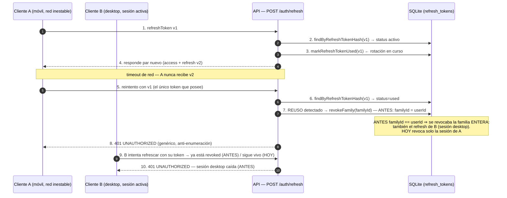
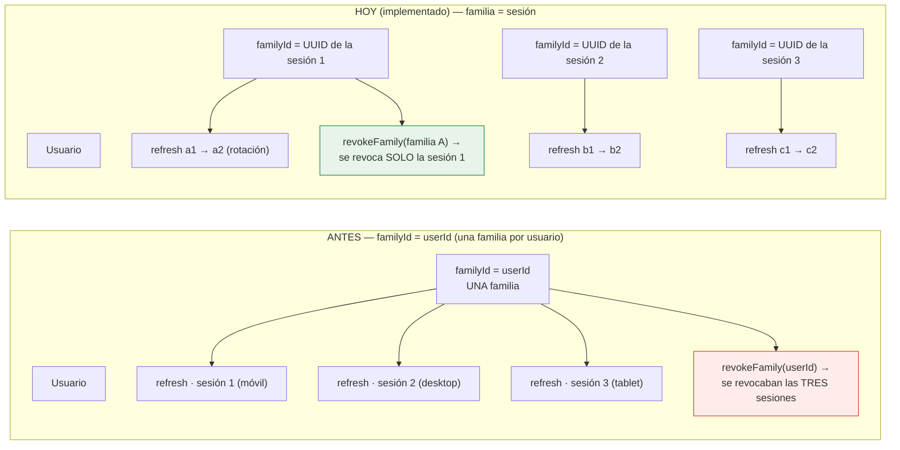
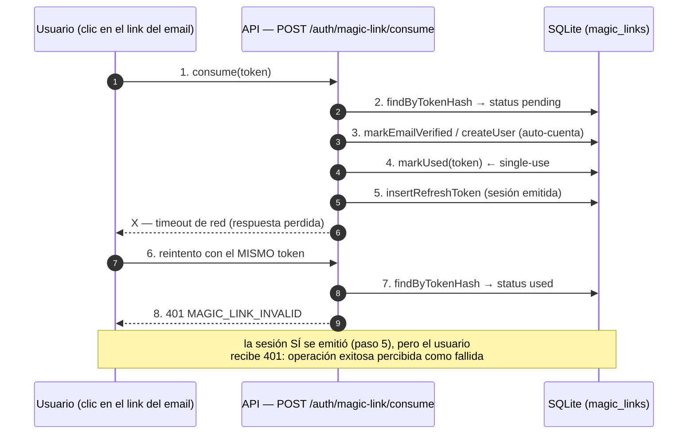
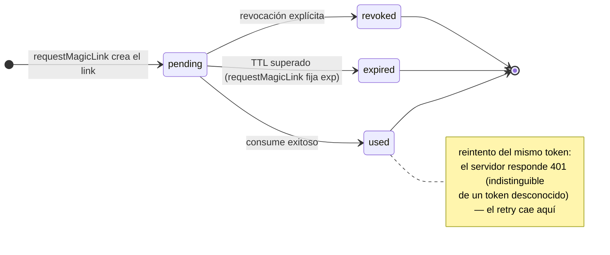
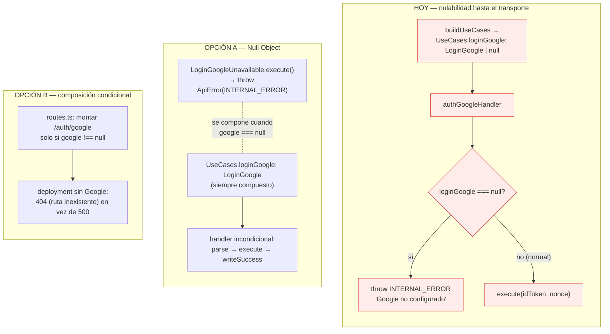

# 12 · Observaciones concretas — tres riesgos del diseño actual

**Stack**: Node.js · Express 5 · TypeScript · Clean Architecture
**Estado**: Revisión de diseño de la arquitectura vigente (capas `api` / `app` / `domain` / `infra`). Documenta tres observaciones concretas, cada una con el escenario que las dispara, un diagrama del problema, las opciones de corrección y su tradeoff. Complementa `10-circuito-handlers-use-cases.md` (flujo de use cases), `04-modelo-de-datos.md` (tablas `refresh_tokens` / `magic_links`) y `00-consideraciones-tecnicas.md` (decisiones de seguridad, ítems 36-38).

## Resumen ejecutivo

| # | Observación | Escenario de fallo | Riesgo | Referencia |
|---|---|---|---|---|
| 12.1 | ~~`familyId = userId` colapsa todas las sesiones en una familia~~ **RESUELTO** (11-sep-2026): familia = UUID de sesión por login | ~~Logout global multi-dispositivo~~ Revocación por sesión | Contenido por sesión (commit `8788e90`) | `issueSession.ts:28` · `refreshTokens.ts:39` · docs/05 §11 · doc 04 → decisión 2 |
| 12.2 | Consumo de magic link no idempotente | Reintento o pre-lectura del mail tras un consumo exitoso | Operación exitosa percibida como fallida (401) | `src/app/useCases/consumeMagicLink.ts:38` |
| 12.3 | `loginGoogle: LoginGoogle \| null` filtra nulabilidad al transporte | Google no configurado en el deployment | Handler con null-check defensivo en la frontera | `src/app/buildUseCases.ts:67` · `src/api/handlers/authHandlers.ts:82` |

Ninguna es un bug en el sentido clásico: son decisiones de diseño que funcionan en el caso feliz, pero cuyo costo aparece en escenarios de red real (reintentos), de ecosistema (pre-lectores de mail) o de configuración (deployments sin Google). **12.1 ya está resuelto** (11-sep-2026: familia = UUID de sesión — commit `8788e90`); se conserva la sección como registro de la motivación y del resultado. Las otras dos son baratas de corregir con el patrón correcto.

---

## 12.1 — ~~`familyId = userId`: una familia por usuario revoca todas las sesiones~~ → RESUELTA: familia = sesión

**Estado: RESUELTA (11-sep-2026)** — `family_id` es un UUID de **sesión** por login (commit `8788e90`), la rotación hereda la familia presentada y el reuso revoca **solo** esa sesión. La sección documenta el riesgo original (por qué se cambió) y cómo quedó resuelto.

### Ubicación (original, pre-corrección)

- `src/app/helpers/issueSession.ts:27` → todo refresh token se creaba con `familyId: input.userId`.
- `src/app/useCases/refreshTokens.ts:37-41` → ante reuso (status `used`/`revoked`), se llamaba `revokeFamily(found.userId)`.
- Como `familyId === userId`, `revokeFamily(userId)` **no revocaba un grupo de tokens: revocaba el usuario completo**. Hoy revoca `found.familyId` (la sesión; `refreshTokens.ts:39`) y `issueSession` recibe `familyId` propio (`issueSession.ts:28`).

### Por qué era un riesgo real, no teórico

El flujo de rotación asume que el cliente recibe de forma confiable el par nuevo (`v2`) antes de volver a usar el viejo. En redes reales eso no se cumple: un móvil que pierde la respuesta del `POST /auth/refresh` reintenta con `v1` — el único token que tiene a mano. Desde la perspectiva del servidor, ese reintento es **indistinguible de un ataque de reuso** (es exactamente la señal que OWASP manda a detectar), así que revoca la familia.

El problema es la *amplitud* de la revocación: al ser la familia el usuario entero, un único reintento de un dispositivo **mata las sesiones de todos los demás**. El reuso deja de ser un mecanismo de contención y se convierte en un arma de denegación de servicio: un atacante que robe un solo refresh token puede forzar el logout global de la víctima en todos sus dispositivos.

El siguiente diagrama muestra el flujo **pre-corrección** que producía el logout global:

> Figura 12.1 · Versión estática: [`12-figura1-reuso-familia.svg`](12-figura1-reuso-familia.svg) · fuente: [`12-figura1-reuso-familia.mmd`](12-figura1-reuso-familia.mmd)

La figura siguiente contrasta el mapeo de familias **pre-corrección** (una por usuario) con el **implementado** (una por sesión):

> Figura 12.2 · Versión estática: [`12-figura2-familias.svg`](12-figura2-familias.svg) · fuente: [`12-figura2-familias.mmd`](12-figura2-familias.mmd)

### Consecuencias del diseño original (por qué se corrigió)

1. **UX**: un fallo de red puntual derribaba las sesiones del usuario en todos los dispositivos ("me desloguearon de todo").
2. **Seguridad amplificada**: el reuso dejaba de *contener* al atacante y se volvía un vector de DoS contra la cuenta completa. La rotación correcta degradera al atacante a "pierde la sesión robada", no a "tumba al usuario".
3. **Ruido de logs**: `REFRESH_REUSE_DETECTED` se disparaba por reintentos legítimos, enterrando las detecciones reales de robo.

### Corrección aplicada — familia por sesión (11-sep-2026, commit `8788e90`)

1. En la **primera emisión** (login, register, consume de magic link, Google): `familyId = UUID de sesión` recién creado. `IssueSessionInput` ahora recibe `familyId: input.familyId` y se toca una línea en `issueSession` (pasar `familyId` en vez de fijar `input.userId`). ✓ implementado (`issueSession.ts:28`)
2. En la **rotación** (`RefreshTokens`): se lee el `familyId` del registro encontrado (`found.familyId`) y se propaga al `insertRefreshToken` — no se recrea. El reuso sigue revocando `revokeFamily(familyId)`, pero la familia ahora abarca solo una sesión. ✓ implementado (`refreshTokens.ts:39`)
3. **Opcional — ventana de gracia** (no aplicada): ante reuso, revocar la familia de forma *diferida* (p. ej. si el mismo `jti` se vuelve a presentar en los próximos 30-60 s, devolver 401 sin revocar todavía). Esto absorbería el reintento legítimo definido por `fetch`/axios manteniendo la detección para el caso adversarial. Pendiente de decisión si se quiere endurecer el reintento legítimo.

**Tradeoff explícito**: familia = sesión reduce la severidad de la respuesta a un token robado (el atacante solo tumba la sesión comprometida, no la cuenta). Es la misma postura que toman los sistemas de token rotation modernos (Auth0, Firebase): contención por sesión, no por cuenta.

---

## 12.2 — Consumo de magic link no idempotente frente a reintentos

### Ubicación

- `src/app/useCases/consumeMagicLink.ts:32-51` → todo token en estado distinto de `pending` responde 401 `MAGIC_LINK_INVALID`, incluido el caso `used`.
- El single-use es una barrera de seguridad deliberada (un link solo debe emitir una sesión) — el problema no es el single-use, es la **respuesta** que recibe un reintento legítimo.

### Escenarios que lo disparan

1. **Timeout de red**: el primer `consume` emite la sesión, pero la respuesta se pierde. El cliente reintenta con el mismo token → 401. La operación tuvo éxito, pero el usuario cree que falló.
2. **Pre-lectores de mail (muy común)**: Gmail, Outlook, Apple Mail y los escáneres de seguridad corporativos abren los enlaces de los correos *antes* que el usuario. Si el escáner consume el link primero, el clic real del usuario recibe 401. Es la queja número uno de los flujos magic link en producción.

> Figura 12.3 · Versión estática: [`12-figura3-retry-magic-link.svg`](12-figura3-retry-magic-link.svg) · fuente: [`12-figura3-retry-magic-link.mmd`](12-figura3-retry-magic-link.mmd)

El ciclo de vida del link muestra exactamente dónde cae el reintento:

> Figura 12.4 · Versión estática: [`12-figura4-estados-magic-link.svg`](12-figura4-estados-magic-link.svg) · fuente: [`12-figura4-estados-magic-link.mmd`](12-figura4-estados-magic-link.mmd)

### Opciones de corrección

| Opción | Comportamiento ante reintento | Ventaja | Costo / riesgo |
|---|---|---|---|
| **A. Consumo idempotente por email** | Si el token ya fue consumido con éxito y pertenece al mismo email, devolver éxito (sesión fresca) | El usuario nunca ve un 401 tras un consumo real; primera UX de magic link | Emite una segunda sesión si el link se filtró (ambas pertenecen al mismo email: no es un privilegio nuevo, pero hay que acotarlo con una ventana y rate limit) |
| **B. Código distinguido `MAGIC_LINK_ALREADY_USED`** | 401/409 con code propio en lugar de `MAGIC_LINK_INVALID` | El cliente distingue "link inválido" de "ya usado por vos" → puede redirigir a login o auto-login | Requiere cambio de contrato (doc 03) y lógica de cliente; no re-emite sesión |
| **C. 401 genérico + documento de cliente** | Se mantiene, y el frontend trata "link ya usado" como "iniciá sesión" | Cero cambios de servidor | El problema UX persiste hasta que el cliente lo maneje; los pre-lectores de mail siguen rompiendo el flujo |

**Punto clave para B y A**: la anti-enumeración (respuesta idéntica) aplica a tokens *desconocidos o vencidos* — responder "ya usado" a quien **posee el token** no filtra información sobre links de otros emails. Distinguir `used` de `invalid` es seguro y no viola el patrón anti-enumeración que ya aplicás. La recomendación es **A o B combinada con rate limit sobre consume** (que ya existe vía `authLimiter`), y documentar el comportamiento para el frontend.

---

## 12.3 — `loginGoogle: LoginGoogle | null` filtra nulabilidad hasta el transporte

### Ubicación

- `src/app/buildUseCases.ts:67` → `google === null` produce `loginGoogle: null` en el tipo `UseCases`.
- `src/api/handlers/authHandlers.ts:82-84` → el handler hace un null-check defensivo ("nunca debería ocurrir") porque el tipo se lo exige.
- `routes.ts:64` → la ruta `/auth/google` **siempre** se monta, incluso en deployments sin Google configurado.

El patrón `google: GoogleIdTokenVerifier | null` dentro de `infra` es correcto y está bien documentado (el verifier es un adaptador opcional). El problema es que la nulabilidad **atraviesa la composición** hasta la frontera HTTP: el transporte termina implementando una rama de lógica de *configuración* en vez de un flujo de negocio.

> Figura 12.5 · Versión estática: [`12-figura5-null-object.svg`](12-figura5-null-object.svg) · fuente: [`12-figura5-null-object.mmd`](12-figura5-null-object.mmd)

### Opciones y recomendación

- **Opción A — Null Object** (recomendada): componer siempre un `LoginGoogle`; cuando `google === null`, instanciar `LoginGoogleUnavailable` cuyo `execute()` lanza `ApiError(INTERNAL_ERROR)` con el mismo mensaje actual. El tipo `UseCases` deja de tener `| null`, el handler queda incondicional y el contrato HTTP se mantiene uniforme en todos los deployments (el endpoint existe, pero no puede operar → 500 explícito, coherente con el OpenAPI).
- **Opción B — composición condicional**: no montar la ruta si no hay config. Elimina el endpoint de la superficie pública de ese deployment (→ 404). Es atractiva, pero hace que el contrato HTTP *varíe según el deployment*: el doc 03 declara `/auth/google`; un 404 donde otro entorno responde 500 exige documentarlo. Menos uniforme que A.

En ambos casos el `| null` interno de `infra` (adaptador opcional) se conserva — lo que se elimina es su **propagación** a `app` y `api`.