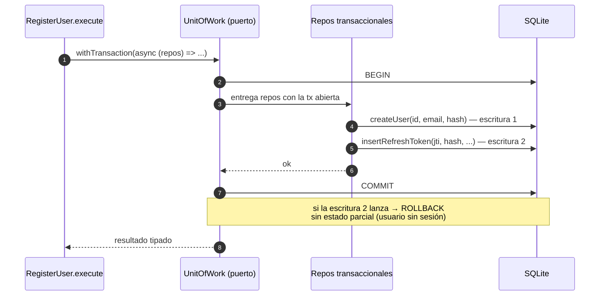
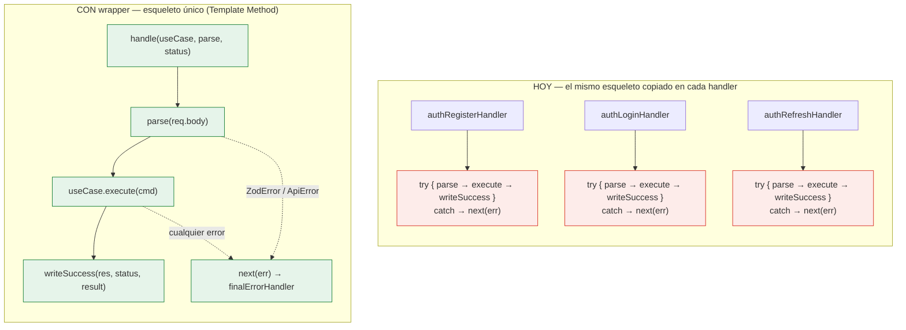
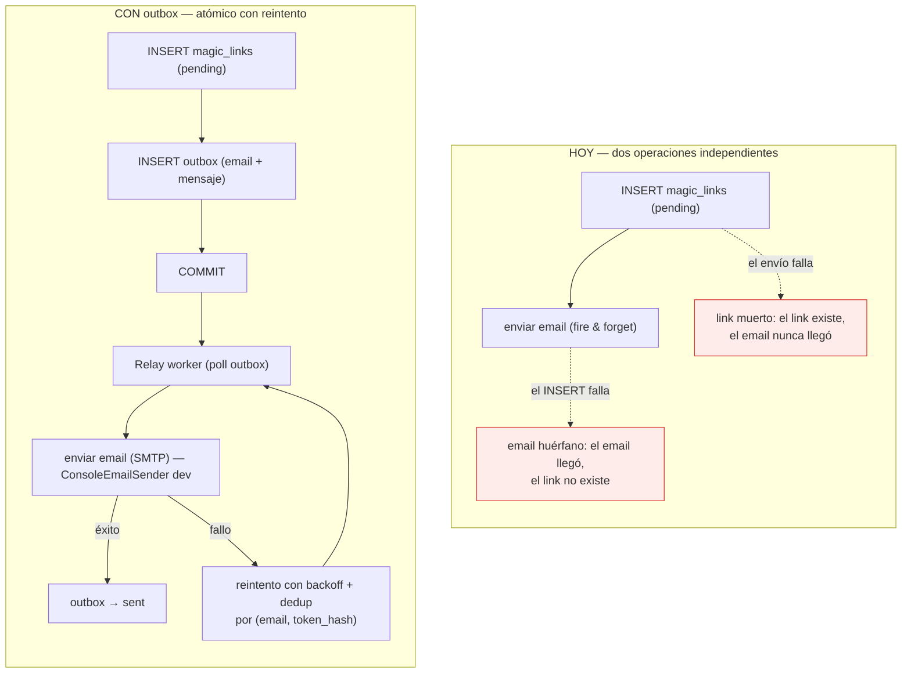
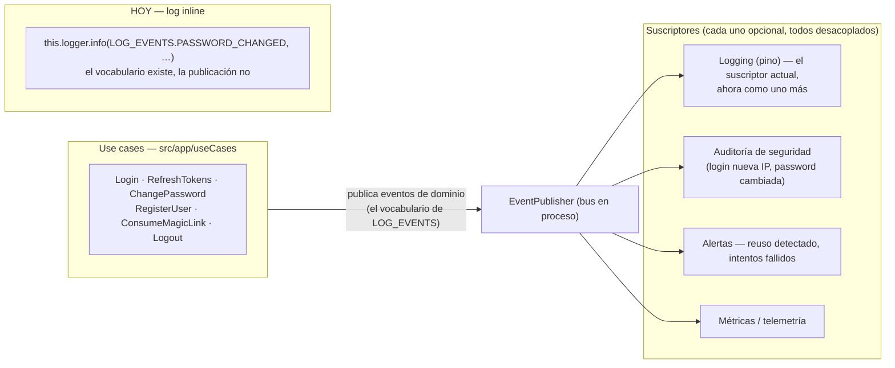
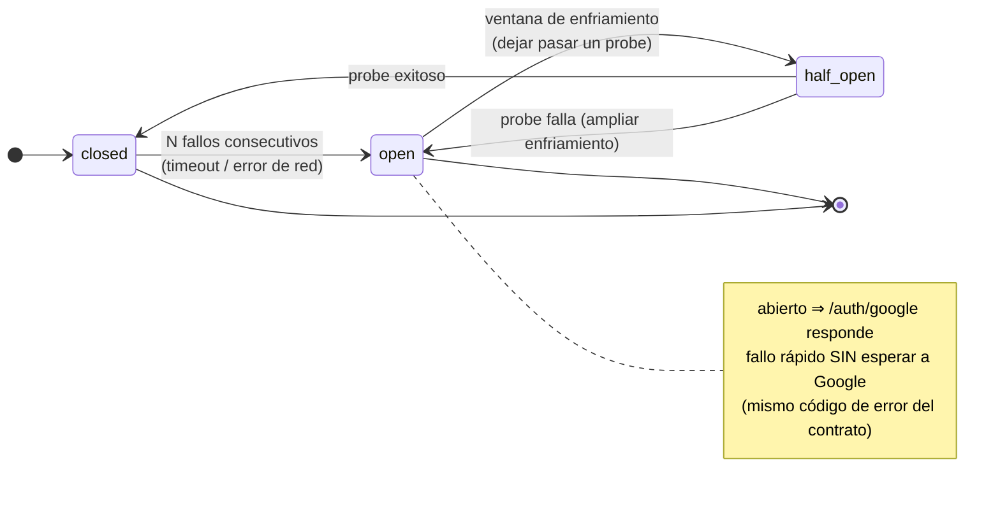
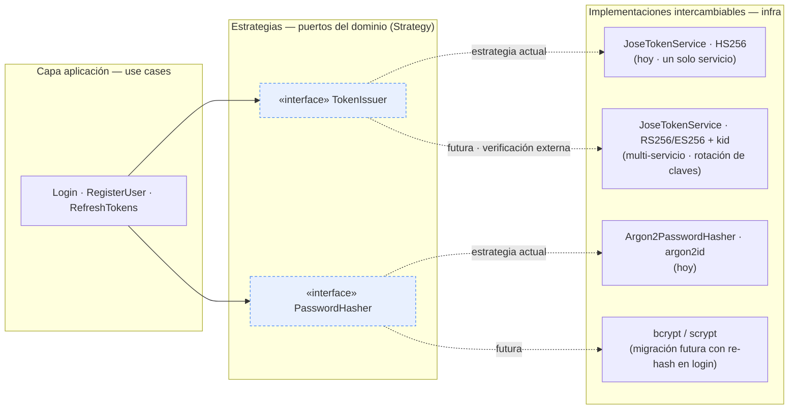

# 13 · Patrones a sumar — recomendaciones de diseño

**Stack**: Node.js · Express 5 · TypeScript · Clean Architecture
**Estado**: Catálogo de patrones de diseño recomendados para la API, ordenados por impacto/esfuerzo. Cada patrón se describe con el problema concreto que resuelve, dónde aplica en el código vigente, un diagrama y la forma de implementación. Complementa `11-dependencias-por-capas.md` (fronteras de capas) y `12-observaciones-concretas.md` (los tres riesgos que varios de estos patrones corrigen).

Los patrones de esta guía se estudian en las fuentes de referencia habituales: [refactoring.guru](https://refactoring.guru/design-patterns/catalog) (Command, Strategy, Observer, Template Method, Null Object), [patterns.dev](https://www.patterns.dev/) (composición de dependencias, provider) y la sección de *System Design / Software Design Patterns* de [geeksforgeeks](https://www.geeksforgeeks.org/system-design/software-design-patterns/) (Transactional Outbox, Circuit Breaker, Unit of Work, Idempotency).

## Resumen ejecutivo

| # | Patrón canónico | Problema que resuelve | Esfuerzo | Dónde aplica |
|---|---|---|---|---|
| 13.1 | Unit of Work | Atomicidad en use cases multi-escritura | Bajo | `registerUser`, `consumeMagicLink`, `resetPassword` |
| 13.2 | Wrapper / Template Method (`asyncHandler`) | Esqueleto repetido en los 10 handlers | Muy bajo | `src/api/handlers/*` |
| 13.3 | Transactional Outbox | Emails fiables cuando llegue un SMTP real | Medio | `EmailSender` + `requestMagicLink` / `resetPassword` |
| 13.4 | Domain Events (Observer) | Efectos secundarios múltiples (auditoría, alertas, métricas) | Medio | `src/app/useCases/*` → publisher + suscriptores |
| 13.5 | Circuit Breaker | Resiliencia ante caída de Google | Bajo | `GoogleIdTokenVerifierJose` |
| 13.6 | Strategy (ya presente) | Intercambio de algoritmos sin tocar dominio | — (consolidar) | `TokenIssuer`, `PasswordHasher` |

---

## 13.1 — Unit of Work: atomicidad en use cases multi-escritura

### Problema

Varios use cases ejecutan **más de una escritura** sin una transacción que las agrupe:

| Use case | Escrituras |
|---|---|
| `RegisterUser` | `createUser` → `insertRefreshToken` (vía `issueSession`) |
| `ConsumeMagicLink` | `markEmailVerified`/`createUser` → `markUsed` → `insertRefreshToken` |
| `ResetPassword` | actualizar hash → consumir link → `insertRefreshToken` |

Si la última escritura falla, el estado queda **parcial**: un usuario creado sin sesión, un link consumido sin cuenta verificada, etc. Con SQLite en single-writer el riesgo de *carrera* es bajo, pero el de *consistencia ante fallo* es real — y crece con cada escritura nueva que se agregue al use case.

### Solución

Exponer la transacción **como un puerto** (para no filtrar SQL a la capa application) y envolver el cuerpo del use case:

```ts
// domain/port/unitOfWork.ts
export interface UnitOfWork {
  withTransaction<T>(fn: (repos: TransactionalRepos) => Promise<T>): Promise<T>;
}
```

`fn` recibe repositorios "transaccionales" (mismas interfaces, mismas firmas) y el puerto se encarga de `BEGIN` / `COMMIT` / `ROLLBACK`. `issueSession` debe recibir el repositorio de la transacción, no el global — por eso la recomendación es que `withTransaction` **entregue** las instancias en lugar de que el use case pida la transacción por su cuenta.



> Figura 13.1 · Versión estática: [`13-figura1-uow.svg`](13-figura1-uow.svg) · fuente: [`13-figura1-uow.mmd`](13-figura1-uow.mmd)

**Tradeoff**: agrupar escrituras en una transacción alarga el tiempo de la tx (las operaciones de hash/verificación externas deben quedar *fuera* de ella — primero verificar, luego abrir la tx). La regla práctica: `BEGIN`/`COMMIT` solo alrededor de las escrituras, nunca alrededor de llamadas lentas o de red.

---

## 13.2 — Wrapper `asyncHandler` (Template Method) para los handlers

### Problema

Los 10 handlers de `src/api/handlers/` repiten el mismo esqueleto de 6 pasos:

```
try → parse(req.body) → useCase.execute(cmd) → writeSuccess(res, status, result) → catch → next(err)
```

Hoy es legible porque son pocos, pero cada endpoint nuevo copia el mismo patrón, y cualquier cambio global (tiempo de respuesta en el envelope, mensurabilidad, formato de errores) exige tocar N archivos. Es el anti-patrón del *copy-paste estructural*.

### Solución — wrapper de 5 líneas

El **Template Method**: el esqueleto vive en un solo lugar; cada handler solo aporta la variación (uso case, parseo, status).

```ts
// src/api/helpers/asyncHandler.ts
export const handle =
  <C, R>(useCase: UseCase<C, R>, parse: (body: unknown) => C, status: number): RequestHandler =>
  async (req, res, next) => {
    try {
      writeSuccess(res, status, await useCase.execute(parse(req.body)));
    } catch (err) {
      next(err);
    }
  };

// authHandlers.ts — cada handler queda en UNA expresión
export const authLoginHandler = handle(useCases.login, credentialsRequest.parse, 200);
```

El contrato de errores no cambia: `next(err)` sigue alimentando `finalErrorHandler`, que ya clasifica `ZodError`, `ApiError` y malformed body. El wrapper no altera la frontera, solo elimina la repetición.



> Figura 13.2 · Versión estática: [`13-figura2-async-handler.svg`](13-figura2-async-handler.svg) · fuente: [`13-figura2-async-handler.mmd`](13-figura2-async-handler.mmd)

---

## 13.3 — Transactional Outbox: emails fiables cuando llegue el SMTP real

### Problema

Hoy `ConsoleEmailSender` no falla, así que la secuencia "insertar magic link → enviar email" es segura por accidente. Con un proveedor SMTP real (SES, Resend, SendGrid) el envío deja de ser fiable y aparecen dos modos de fallo:

- **Link muerto**: el `INSERT` del link hace commit, el envío falla → el usuario recibe un email que apunta a un link que nadie puede consumir (ni siquiera existe en el correo, porque no se envió).
- **Email huérfano**: el envío sale bien, pero el `INSERT` del link revierte → el usuario recibe un link que el servidor no reconoce.

Además, todo reintento manual duplica emails o links.

### Solución — Outbox transaccional

El patrón estándar (geeksforgeeks / patrones de sistemas distribuidos): el **mensaje a enviar se persiste en la misma transacción** que el dato de negocio; un worker independiente lee la cola outbox, envía y marca. La creación del link y la programación del email pasan a ser **atómicas**: o ambas, o ninguna.



> Figura 13.3 · Versión estática: [`13-figura3-outbox.svg`](13-figura3-outbox.svg) · fuente: [`13-figura3-outbox.mmd`](13-figura3-outbox.mmd)

**Qué NO cambia**: el puerto `EmailSender` queda intacto — el outbox lo envuelve, no lo reemplaza. Los use cases siguen dependiendo de la misma interfaz. El worker es infraestructura nueva (un `setInterval`/cron con `SELECT ... FOR UPDATE SKIP LOCKED` sobre la tabla outbox). En dev con `ConsoleEmailSender` el worker puede dormir o enviar inline; el patrón madura junto con el proveedor real.

---

## 13.4 — Domain Events (Observer): desacoplar efectos secundarios

### Problema

Los efectos secundarios de los use cases (auditoría, alertas de seguridad, notificaciones, métricas) hoy se expresan como **logs inline**: `this.logger.info(LOG_EVENTS.USER_REGISTERED, …)` repartido por cada use case. Funciona mientras el único consumidor es pino. El día que un login desde IP nueva deba *alertar*, un `PASSWORD_CHANGED` deba *enviar email*, y el reuso detectado deba *sumar a un dashboard*, cada use case tendrá que conocer a cada consumidor — acoplamiento directo.

### Solución — Observer / Domain Events

La observación clave: **el vocabulario de eventos ya existe** en `src/domain/port/logEvents.ts` (`USER_REGISTERED`, `USER_LOGGED_IN`, `TOKENS_REFRESHED`, `REFRESH_REUSE_DETECTED`, `PASSWORD_CHANGED`, `MAGIC_LINK_CONSUMED`…). Formalizar significa publicarlos en vez de solo loguearlos: el use case emite un evento tipado; los suscriptores (log, auditoría, alertas, métricas) reaccionan sin que el use case los conozca.



> Figura 13.4 · Versión estática: [`13-figura4-domain-events.svg`](13-figura4-domain-events.svg) · fuente: [`13-figura4-domain-events.mmd`](13-figura4-domain-events.mmd)

**Implementación pragmática**: empezar con un bus **síncrono en proceso** (10 líneas sobre un `Set` de suscriptores o el `EventEmitter` de Node); los suscriptores reciben el evento y son responsables de su propio manejo de errores (un suscriptor que falla no debe tumbar el use case). El bus **no** debe serializar ni persistir eventos — si eso se necesita, es un outbox (13.3) más un dispatcher, no el propio bus. La advertencia habitual: es el patrón que más se sobre-ingenieriza; solo hace falta cuando hay **≥2 consumidores** por evento o consumidores fuera del proceso.

---

## 13.5 — Circuit Breaker: resiliencia ante la caída de Google

### Problema

`GoogleIdTokenVerifierJose` depende de una red externa (JWKS de Google + verificación). Cuando Google sufre una caída o degradación, **cada `POST /auth/google`** espera el timeout de la llamada externa antes de responder — latencia alta en una ruta que debería ser de milisegundos, y efectos en cadena si el tráfico acumula conexiones. (Las claves JWKS ya las cachea `createRemoteJWKSet` de jose — esa parte está resuelta; lo que falta es resiliencia sobre la llamada.)

### Solución — Circuit Breaker

Máquina de estados clásica: **cerrado → abierto → semi-abierto**. Mientras está abierto, la ruta responde **fallo rápido** (sin esperar a Google), con el error del contrato (`INTERNAL_ERROR` o un degradado explícito); un *probe* periódico decide cuándo volver a permitir tráfico real.



> Figura 13.5 · Versión estática: [`13-figura5-circuit-breaker.svg`](13-figura5-circuit-breaker.svg) · fuente: [`13-figura5-circuit-breaker.mmd`](13-figura5-circuit-breaker.mmd)

**Forma de implementación**: el breaker envuelve al adaptador (`GoogleIdTokenVerifierJose` implementa el puerto; el breaker es *otro* adaptador del mismo puerto que delega, con la máquina de estados encima). Como es un adaptador más, `composeInfra` lo inyecta sin tocar dominio — y los tests pueden inyectar un breaker en estado abierto para verificar la ruta degradada. Complemento barato: **timeout explícito** en el verifier (hoy no lo tiene) para que el fallo sea rápido incluso antes de que el breaker abra.

---

## 13.6 — Strategy: el intercambio de algoritmos ya está resuelto (consolidar)

### Observación

`TokenIssuer` y `PasswordHasher` **ya son Strategy** en el sentido canónico de refactoring.guru: una interfaz común y una familia de implementaciones intercambiables inyectadas por composición. El valor de este patrón no es estructural (ya está), sino **el plan de migración que habilita**:

1. **Firma de access tokens — HS256 → RS256/ES256 cuando haya multi-servicio**: el día que otro servicio deba *verificar* los tokens sin compartir secreto, el cambio es un adaptador nuevo (clave pública/privada + `kid` en el header) y una ventana de doble aceptación (el adaptador verifica contra la clave nueva y la anterior mientras expiran los tokens viejos). La infraestructura JWKS ya está resuelta en el adaptador de Google — es el mismo mecanismo.
2. **Password hashing — Argon2 → futuro algoritmo**: la migración clásica de hashes (verificar con el algoritmo viejo, re-hashear con el nuevo en el siguiente login exitoso) es un adapter nuevo + un flag, sin tocar el dominio.
3. **Token rotation — opaco → JWT de refresh si algún día se necesita introspección sin BD**: mismo puerto, otro adaptador.



> Figura 13.6 · Versión estática: [`13-figura6-strategy.svg`](13-figura6-strategy.svg) · fuente: [`13-figura6-strategy.mmd`](13-figura6-strategy.mmd)

**Qué consolidar**: `JoseTokenService` hoy fija `HS256` y el secreto en el constructor; si el plan es multi-servicio, conviene que el adaptador acepte (clave, algoritmo permitido, `kid`) como configuración en vez de literales — así la migración del punto 1 queda como *cambio de opciones de composición*, no de código.

---

## Orden de implementación sugerido

| Paso | Patrón | Por qué primero |
|---|---|---|
| 1 | 13.2 `asyncHandler` | Esfuerzo mínimo, elimina repetición estructural en cada cambio futuro |
| 2 | 13.1 Unit of Work | Corrige el riesgo de consistencia de 13.x — toca use cases ya escritos |
| 3 | 12.1 familia por sesión | Corrección de seguridad/UX de mayor impacto del doc 12 |
| 4 | 13.5 Circuit Breaker + timeout de Google | Bajo esfuerzo, protege una ruta con dependencia externa |
| 5 | 12.3 Null Object (Google) | Simplifica el transporte una vez que el doc 13.5 ya encapsula al verifier |
| 6 | 12.2 Idempotencia de magic link | Requiere decisión de contrato (doc 03) → programarla |
| 7 | 13.4 Domain Events | Solo cuando haya ≥2 consumidores por evento |
| 8 | 13.3 Transactional Outbox | Cuando entre el proveedor SMTP real |